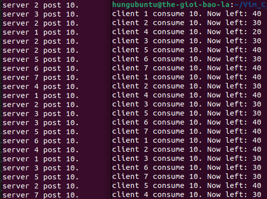

# About this example

I am implementing a setup where two processes: a producer and a consumer, use shared memory and semaphore.

I use a semaphore to limit the number of producers and consumers that can access the shared data area. Additionally, I use another semaphore as a `mutex` lock to protect the data, allowing only one process to access it at a time.

Specifically, `empty` represents the producer, and `full` represents the consumer.

```c
sem_t *empty; /* producer */
sem_t *full;  /* consumer */
sem_t *mutex; /* lock */
```

The specific model is as follows:

Producer:

```c
sem_wait(&empty);
sem_wait(&mutex);

*(int *)ptr += 10;

sem_post(&mutex);
sem_post(&full);
```

Consumer:

```c
sem_wait(&full);
sem_wait(&mutex);

*(int *)ptr -= 10;

sem_post(&mutex);
sem_post(&empty);
```

- If slot is full: `empty = 0`, producer: `sem_wait(&empty);` → block.

- If slot is empty: `full = 0`, consumer: `sem_wait(&full);` → block.

The result is below:

