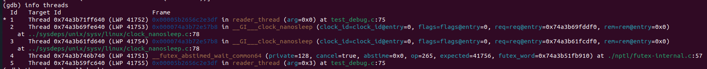
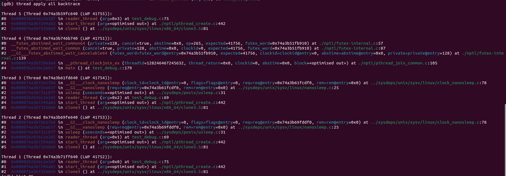
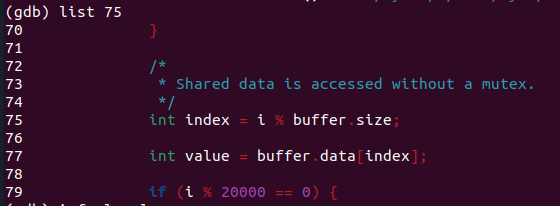
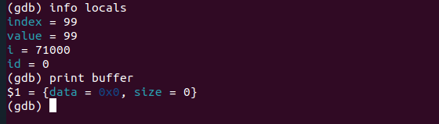

# For this example, I asked ChatGPT to generate a source code containing an error, and then I used gdb to find out where the error was.

# With multi-thread program I will use two commands to see the problem.

## Use ***`info threads`***

## Use ***`thread apply all backtrace`***

After I use these commands, I can see that there are 5 threads running.

There are two threads stop at `reader_thread` function, line 75 (thread 1 and thread 5).

There are two threads stop at `sleep` function (thread 2 and thread 3).

There are 1 thread stop at `pthread_join` function (thread 4).

Then I see the source code in `reader_thread` function at line 75 in file `test_debug.c`

## See code around the error line

## See the value of variable

Okey, After I see source and some local variables in this function, I find out `buffer.data = 0x0`, this mean the `buffer.data` pointer is pointing to `NULL` and it cause to crash program.

After that, I will carefully read the source code to identify the exact error.