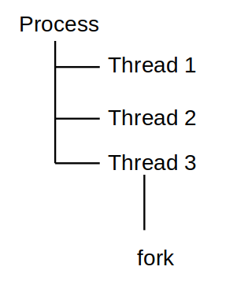

# 1. What is thread?

[](http://10.0.0.220:9090/uploads/images/gallery/2026-09/image.png)

> *"A thread is a single sequence stream within a process and is called a lightweight process because it is smaller and faster. It allows multiple tasks to run simultaneously, improving program efficiency."*

Threads share:

```text
Code
Global variables
Heap
Open file descriptors
...
```

but each thread has:

```c
Register state
Stack
Thread ID
Scheduling state
```

[](http://10.0.0.220:9090/uploads/images/gallery/2026-09/image-1.png)

## 1.1 Why we need thread?

**Thread** are needed in modern operating systems and applications because they:

- **Improve Performance**: Threads allow multiple tasks to run at the same time (parallel or interleaved), making programs execute faster.
- **Increase Responsiveness**: If one thread is busy, another can handle user actions, keeping the application responsive.
- **Enable Concurrency**: Multiple operations like saving files, processing data, and handling user input can happen simultaneously.
- **Better CPU Utilization**: On multi-core systems, threads can run on different cores, improving overall system performance.
- **Efficient Resource Sharing**: Threads share the same memory and resources within a process, making communication faster and reducing overhead.

## 1.2 Compare Thread and Proces

**Process**

|Strength|Weakness|
|:-----|:-----|
|Good isolation|Creation/management is usually more resource-intensive.|
|Good fail isolaton|Complex IPC|
|Good security boundary|Data sharing is more difficult.|
|Specific address space||

**Thread**

|Strength|Weakness|
|:-----|:-----|
|Consumes less memory than the process|Shared memory → race condition|
|Easily share memories|Need synchronization|
|Inter-thread communication is very fast|A memory error can affect the entire process.|
|Suitable for parallel/concurrent work within the same application|A deadlock can occur.|

## 1.3 Components of Threads

These are the basic components of the Operating System.

- **Thread id**: Each thread has a thread ID to determine what thread is running.
- **Stack Space**: Stores local variables, function calls, and return addresses specific to the thread.
- **Register Set**: Hold temporary data and intermediate results for the thread's execution.
- **Program Counter**: Tracks the current instruction being executed by the thread.

## 1.4 Types of Threads

Threads are mainly classified based on how they are managed and scheduled in an operating system. There are two primary types of threads.

- User Level Thread
- Kernel Level Thread

[](http://10.0.0.220:9090/uploads/images/gallery/2026-09/image-2.png)

**User-Level Threads (ULTs)**

- Managed entirely in user space using a thread library; the kernel is unaware of them.
- Switching between ULTs is fast since only program counter, registers, and stack need to be saved/restored.
- Do not require system calls for creation or management, making them lightweight.
- If one thread makes a blocking system call, the entire process (all threads) is blocked.
- Scheduling is done by the application itself, which may not be as efficient as kernel-level scheduling.
- Cannot fully utilize multiprocessor systems because the kernel schedules processes, not individual user-level threads.

**Kernel-Level Threads (KLTs)**

- Managed directly by the operating system kernel; each thread has an entry in the kernel’s thread table.
- The kernel schedules each thread independently, allowing true parallel execution on multiple CPUs/cores.
- Handles blocking system calls efficiently; if one thread blocks, the kernel can run another thread from the same process.
- Provides better load balancing across processors since the kernel controls all threads.
- Context switching is slower compared to ULTs because it requires switching between user mode and kernel mode.
- Implementation is more complex and requires frequent interaction with the kernel.
- Large numbers of threads may add extra load on the kernel scheduler, potentially affecting performance.

# 2. How to create thread?

On Linux, the common API for thread programming is POSIX Threads, often referred to as: `pthread`

**Library:**

```c
#include <ptheread.h>
```

Create thread:

**Prototype**

```c
int pthread_create (pthread_t *__restrict __newthread,
      const pthread_attr_t *__restrict __attr,
      void *(*__start_routine) (void *),
      void *__restrict __arg) __THROWNL __nonnull ((1, 3));
```

**Return:**

- 0 :           if success
- error number: if error

**Example**

```c
/* routine function thread will execute when it is created */
void *worker(void *arg)
{
    printf("Hello from thread %d\n", *p);
    return NULL;
}

int main(void)
{
    pthread_t tid;

    pthread_create(&tid,   /*  consit thread id */
                   NULL,   /* config of thread */
                   worker, /* function pointer */
                   &x);    /* argument pass into function pointer */

    pthread_join(tid, NULL);
    return 0;
}
```

**Thread** has a weakness: If thread 1 and thread 2 access simultaneously into an address, it is a **race condition**.  

Therefore, it needs:

```text
mutex
condition variable
semaphore
```

## 2.1 Thread ID

> Thread ID is used to distinguish between threads.

- **Manage threads**: When you want to control a specific thread (for example: to pause or cancel it, or to wait for it to finish using `thread_joint(id, NULL)`), you must specify it's ID.
- **Monitoring and Debuging**: when printing messages to the screen (logging), including thread ID helps you identify exactly which thread is executing.

Prototype:

```c
extern pthread_t pthread_self (void);
````

An examle of printing the thread ID:

```c
void* print_id(void* arg) {
    pthread_t my_id = pthread_self();
    
    printf("Thread id: %lu\n", (unsigned long)my_id);
    
    return NULL;
}

int main() {
    pthread_t thread1, thread2;

    pthread_create(&thread1, NULL, print_id, NULL);
    pthread_create(&thread2, NULL, print_id, NULL);

    pthread_join(thread1, NULL);
    pthread_join(thread2, NULL);

    return 0;
}
```

```text
Thread id: 131767210079808
Thread id: 131767201687104
```

> When you want to check whether two threads have the same id, you can use `pthread_equal(id1, id2)`.

Return value:

- nonzero : if equal
- 0       : otherwise

## 2.2 pthread_join()

> The current thread waits for a specific thread to finish.

Prototype:

```c
int pthread_join(
    pthread_t thread,   /* thread id want to wait */
    void **return_value /* the value of thread return */
);
```

Return value:

> On success, `pthread_join()` returns 0;  
> On error, it returns an error number.

Example:

```c
void *worker(void *arg)
{
    printf("Worker: start\n");

    int *rel = malloc(sizeof(int));

    *rel = 123;

    sleep(2);

    printf("Worker: end\n");

    return rel;
}

int main(void)
{
    pthread_t tid;

    void *ret = NULL;

    pthread_create(&tid, NULL, worker, NULL);

    printf("Main: waiting...\n");

    pthread_join(tid, &ret);

    printf("Main: worker finished\n");

    printf("%d\n", *(int *)ret);
    free(ret);

    return 0;
}
```

```text
Main: waiting...
Worker: start
Worker: end
Main: worker finished
123                      <-------- the return value of thread
```

Without `pthread_join()`, the `main` function might terminate before the thread completes its work.

## 2.3 Terminate Thread

A thread can terminate by:

- canceled by another thread in the same process `int pthread_cancel (pthread_t th_id)`
- calls `pthread_exit(NULL)`
- returns from `routine()`

Example using `pthread_cancel()`:

```c
#include <stdio.h>
#include <pthread.h>
#include <string.h>
#include <unistd.h>

pthread_t thread_id[2];
/*
This function will be implemented by thread 1 and thread 2.
*/
void *rountine(void *arg)
{
    /*
    Thread 1 implement
    */
    if (pthread_equal(pthread_self(), thread_id[0]))
    {
        printf("Thread 1 will sleep in 5 seconds.\n");
        sleep(5);
    }
    /*
    Thread 2 implement
    */
    else if (pthread_equal(pthread_self(), thread_id[1]))
    {
        printf("Thread 2 will cancel thread 1.\n");
        pthread_cancel(thread_id[0]);
    }
    return NULL;
}

int main(int argc, char *argv[])
{
    /* create two threads */
    for (int i = 0; i < 2; i++)
    {
        if (pthread_create(&thread_id[i], NULL, rountine, NULL) != 0)
        {
            printf("Create thread %d fail!\n", i + 1);
            return (i + 1);
        }
    }

    /* join thread and get the return value of thread_join */
    for (int i = 0; i < 2; i++)
    {
        int ret = pthread_join(thread_id[i], NULL);
        if (ret != 0)
        {
            printf("Create thread %d fail!\n", i + 1);
            return (i + 1);
        }
        else
        {
            printf("Thread %d exit with return value: %d (%s)\n",
                   i + 1, ret, strerror(ret));
        }
    }

    return 0;
}
```

```text
Thread 1 will sleep in 5 seconds.
Thread 2 will cancel thread 1.
Thread 1 exit with return value: 0 (Success)
Thread 2 exit with return value: 0 (Success)
```

## 2.4 pthread_detach()

There are two way to manage thread:

- **Joinable**: nead call `pthread_join()` to reclaim resource.  
- **Detached**: auto reclaim resource after thread finished. It is not possible to `pthread_join()` it after that.

Prototype:

```c
int pthread_detach (pthread_t __th);
```

Example:  

```c
void *delay_1(void *arg)
{
    printf("Thread is delaying 5s ...\n");
    sleep(5);
    printf("Thread stopped!\n");
    return NULL;
}

int main(void)
{
    int ret;

    pthread_t tid1;

    pthread_create(&tid1,    /*  consit thread id */
                   NULL,     /* config of thread */
                   delay_1,  /* function pointer */
                   NULL);    /* argument pass into function pointer */
    pthread_detach(tid1);

    printf("Main is still running ...\n");

    ret = pthread_join(tid1, NULL);
    
    sleep(1);
    printf("%d\n", ret);
    printf("Main stopped!\n");

    return 0;
}
```

```text
Main is still running ...
Thread is delaying 5s ...
22                          <---- error number when using pthread_join()
Main stopped!
```

It appears that the main function continues executing while the thread is running; I called `pthread_join()`, but it didn't work and return an error number `22`, causing the main function to terminate before the thread finished its task.

**Tip**

> A detached thread is suitable for a worker when you do not need to retrieve a result or wait for it to complete.

# 3. Race Condition

## 3.1 What is Concurrency?

> Concurrency mean that two threads run simultaneously.  

In reality, only one thread is executed by the CPU at a time, but the CPU can rapidly switch between threads to create the effect of them executing in parallel.

## 3.2 Race Condition

> A race condition is an error where the program's outcome depends on the uncontrolled order or interleaving of threads.

Example i have 1000 threads add 1 to x 1000 times:

```c
#include <stdio.h>
#include <pthread.h>

void *rountine(void *arg)
{
    int *p = arg;
    /* add 1 to x and loop it 1000 times*/
    for (int i = 0; i < 1000; i++)
    {
        *p += 1;
    }

    return NULL;
}

int main(int argc, char *argv[])
{
    int x = 0;
    /* I will create 1000 thread */
    int numthread = 1000;
    pthread_t thread_id[numthread];

    /* create thread and run the routine function with the argument is x */
    for (int i = 0; i < numthread; i++)
    {
        if (pthread_create(&thread_id[i], NULL, rountine, &x) != 0)
        {
            printf("Create thread %d fail.\n", i + 1);
            return (i + 1);
        }
    }

    /* join thread */
    for (int i = 0; i < numthread; i++)
    {
        if (pthread_join(thread_id[i], NULL) != 0)
        {
            printf("join thread %d fail.\n", i + 1);
            return (i + 101);
        }
    }

    /* ptint out the value of x after 1000 thread run */
    printf("x = %d\n", x);

    return 0;
}
```

```text
x = 994728
```

As we expected, x must be 1000000, but actually, x is 994728. It is **race condition**.  

We can fix it by using a variable `lock` following example below:

```c
void *rountine(void *arg)
{
    int *p = arg;
    /* add 1 to x and loop it 1000 times*/
    for (int i = 0; i < 1000; i++)
    {
        while(lock == 1)
        {
            /* wait until lock = 0 */
        }
        lock = 1;
        *p += 1;
        lock = 0;
    }

    return NULL;
}
```

Using a variable `lock` to lock a segment code is a good idea, but the way I carried it out was terrible.  
In fact, we have a interface in `phtread` library that allows us to do that. `pthread_mutex`

# 4. Thread Synchronization

## 4.1 pthread_mutex

> Mutex = Mutual Exclusion

A mutex is basically a lock that we set (lock) before accessing a shared resource and release (unlock) when we’re done.

Declare:

```c
pthread_mutex_t mutex = PTHREAD_MUTEX_INITIALIZER;
```

Basic structual:

```c
pthread_mutex_lock(&mutex);
/*
 * critical section
 */
pthread_mutex_unlock(&mutex);
```

Example: I will use the example provided in section ***3.2 Race condition***. But now, I use `pthread_mutex` to protect the increment operation.

```c
#include <stdio.h>
#include <pthread.h>

pthread_mutex_t mutex = PTHREAD_MUTEX_INITIALIZER;

void *rountine(void *arg)
{
    int *p = arg;
    /* add 1 to x and loop it 1000 times*/
    for (int i = 0; i < 1000; i++)
    {
        pthread_mutex_lock(&mutex);
        *p += 1;
        pthread_mutex_unlock(&mutex);
    }

    return NULL;
}
```

```text
x = 1000000
```

That's right, the results are exactly as we expected.

**A quick note:**  
If thread 1 uses `pthread_mutex_lock` but thread 2 doesn't use it, thread 2 can still access the variable being protected by thread 1.  
  
Example:

```c
#include <stdio.h>
#include <pthread.h>

pthread_mutex_t mutex = PTHREAD_MUTEX_INITIALIZER;

/* Thread 1 use mutex to lock critical section */
void *rountine(void *arg)
{
    int *p = arg;
    /* add 1 to x and loop it 1000 times*/
    for (int i = 0; i < 1000; i++)
    {
        pthread_mutex_lock(&mutex);
        *p += 1;
        pthread_mutex_unlock(&mutex);
    }

    return NULL;
}

/*
Thread don't use mutex and is able to access to critical section
*/
void *rountine1(void *arg)
{
    int *p = arg;
    /* add 1 to x and loop it 1000 times*/
    for (int i = 0; i < 1000; i++)
    {
        *p += 1;
    }

    return NULL;
}

int main(int argc, char *argv[])
{
    int x = 0;
    /* I will create 1000 thread */
    int numthread = 1000;
    pthread_t thread_id[numthread];
    pthread_t id;


    /* create thread use mutex lock */
    for (int i = 0; i < numthread; i++)
    {
        if (pthread_create(&thread_id[i], NULL, rountine, &x) != 0)
        {
            printf("Create thread %d fail.\n", i + 1);
            return (i + 1);
        }
    }

    /* create thread that doesn't use mutex lock */
    pthread_create(&id, NULL, rountine1, &x);

    /* join thread */
    for (int i = 0; i < numthread; i++)
    {
        if (pthread_join(thread_id[i], NULL) != 0)
        {
            printf("join thread %d fail.\n", i + 1);
            return (i + 101);
        }
    }

    /* join thread */
    pthread_join(id, NULL);

    /* ptint out the value of x after 1000 thread run */
    printf("x = %d\n", x);

    return 0;
}
```

```text
x = 1000954
```

The result I expected is 1001000 but as we can see, it is 1000954. Why is that? Because there is a thread that does not use the mutex, so it can access the variable x while it is being protected. It is race condition.

### What is Critical section?

> A critical section is a segment of code that accesses a shared resource and for which we want to control concurrent execution by multiple threads.

In the `pthread_mutex` example above, the code `*p += 1;` is protected by `lock` and `unlock` operations; this is a critical section.

### try_lock

If a thread simply wants to attempt to acquire a lock without being blocked while waiting for it to be released, it can perform other operations upon a failed attempt and then try to acquire the lock again if necessary.

Prototype:

```c
int pthread_mutex_trylock (pthread_mutex_t *__mutex)
```

Return:

- 0: The lock was successfully acquired.
- EBUSY: The mutex is already locked by another thread.
- Other error code: A system failure occurred.

Example:

```c
#include <stdio.h>
#include <pthread.h>
#include <unistd.h>
#include <errno.h>

pthread_mutex_t my_mutex = PTHREAD_MUTEX_INITIALIZER;

/*
funtion lock
*/
void* thread_function1(void* arg) {
    printf("[Thread 1] Locked in 2 seconds.\n");
    pthread_mutex_lock(&my_mutex);
    
    sleep(2);
    
    pthread_mutex_unlock(&my_mutex);
    printf("[Thread 1] Lock released.\n");
    return NULL;
}

/*
function try lock
*/
void* thread_function2(void* arg) {
    sleep(0.5);
    
    for (int i = 0; i < 100; i++) {
        int result = pthread_mutex_trylock(&my_mutex);
        
        /* try lock success */
        if (result == 0) {
            printf("[Thread 2] Try lock success at %d times.\n", i + 1);
            pthread_mutex_unlock(&my_mutex);
            break;
        }
        /* lock busy */
        else if (result == EBUSY) {
            printf("[Thread 2] Lock busy on attempt %d.\n", i + 1);
            sleep(1);
        }
        /* try lock error */
        else {
            printf("[Thread 2] An error occurred.\n");
            break;
        }
    }
    return NULL;
}

int main() {
    pthread_t thread1, thread2;

    pthread_create(&thread1, NULL, thread_function1, NULL);
    pthread_create(&thread2, NULL, thread_function2, NULL);

    pthread_join(thread1, NULL);
    pthread_join(thread2, NULL);
    
    pthread_mutex_destroy(&my_mutex);
    return 0;
}
```

```text
[Thread 1] Locked in 2 seconds.
[Thread 2] Lock busy on attempt 1.
[Thread 2] Lock busy on attempt 2.
[Thread 1] Lock released.
[Thread 2] Try lock success at 3 times.
```

### spin lock

Concept:

```c
while (CAS(&lock, 0, 1) != SUCCESS)
{
    // wait
}
```

```text
              lock = 0
                  │
          ┌───────┴───────┐
          ▼               ▼
         T1               T2
          │               │
       CAS 0→1         CAS 0→1
          │               │
       SUCCESS           FAIL
          │               │
          ▼               ▼
       ENTER            WAIT
       critical            │
       section             │
          │                │
       unlock              │
          │                │
          └────────────► retry
```

***Spin lock has a problem***:  
If thread 1 is occupying the critical section, thread 2 will continously attempt to access it until successful. Therefore, thread 2 consumes CPU to wait. This is **Busy Waiting/ Spinning**.

### Blocking Lock

Thread 2 will no longer attempt to access the critical section; instead, it will enter a sleep state and be awakened by the system when Thread 1 unlocks it.

```text
T1 lock()

T2
 │
 └── lock()
       │
       ▼
    unavailable
       │
       ▼
      SLEEP
       │
       │
    mutex available
       │
       ▼
     WAKE
       │
       ▼
    acquire
```

**Compare between Spin lock and Blocking lock**:

| | Spinlock | Blocking lock |
| :----------------- | :------------------- | :-------------------- |
| When lock is busy | CPU keeps running | Thread sleeps |
| CPU usage | High | Low |
| Context switch | Not immediately required | May occur |
| Short hold time | Good | Potential overhead |
| Long hold time | Poor | Good |
| Implementation | Atomic instructions | Atomic + wait/wakeup |

## 4.2 Reader-Writer Lock

> A Reader-Writer Lock (rwlock) is a synchronization primitive designed for scenarios where a shared resource involves two types of access:

- Reader: only read
- writer: change data

If there are multiple threads but they only need to read data, they can access the shared data simultaneously.  
If a thread wants to write data, it must wait for all current readers to release the lock.  
And if one thread is writing data while another wants to read it, the reading thread must wait for the writing thread to release the lock.  

Prototype:

**Reader:**

```c
    pthread_rwlock_rdlock(&rwlock);
    printf("%d\n", x);
    pthread_rwlock_unlock(&rwlock);
```

**Writer:**

```c
    pthread_rwlock_wrlock(&rwlock);
    x += 10;
    pthread_rwlock_unlock(&rwlock);
```

Example I will create 200 reading threads and after I have created 100 reading threads, I create writing thread to wite data to `x`:

```c
#include <stdio.h>
#include <pthread.h>
#include <unistd.h>

pthread_rwlock_t rwlock = PTHREAD_RWLOCK_INITIALIZER;
pthread_t thid1[2000], thid2;

int x = 0;

void *reader(void *arg)
{
    printf("Thread read x: ");
    pthread_rwlock_rdlock(&rwlock);
    printf("%d\n", x);
    pthread_rwlock_unlock(&rwlock);

    return NULL;
}

void *writer(void *arg)
{
    printf("Thread will add 10 to x.\n");
    pthread_rwlock_wrlock(&rwlock);
    x += 10;
    pthread_rwlock_unlock(&rwlock);
    printf("Thread write unlock.\n");
    return NULL;
}

int main(int argc, char *argv[])
{
    /* create 200 thread reader  */
    for (int i = 0; i < 200; i++)
    {
        if (i == 100)
        {
            /* create thread writer */
            if (pthread_create(&thid2, NULL, writer, NULL) != 0)
            {
                printf("Create thread writer fail.\n");
                return -99999;
            }
        }
        if (pthread_create(&thid1[i], NULL, reader, NULL) != 0)
        {
            printf("Create thread %d fail.\n", i + 1);
            return -(i + 1);
        }
    }

    /* join thread reader */
    for (int i = 0; i < 200; i++)
    {
        if (pthread_join(thid1[i], NULL) != 0)
        {
            printf("Join thread %d fail.\n", i + 1);
            return -(i + 1);
        }
    }

    /* join thread writer */
    pthread_join(thid2, NULL);

    return 0;
}
```

```text
Thread read x: 0
Thread read x: 0
Thread read x: 0
Thread read x: 0
Thread will add 10 to x.
Thread write unlock.
Thread read x: 10
Thread read x: 10
Thread read x: 10
Thread read x: 10
Thread read x: 10
```

As we can see, while the writing thread writes data, no reading thread is permitted to read data.

### When we use rwlock?

A function is called reentrant if multiple executions of the function can occur concurrently without corrupting each other's state.

rwlock is suitable when:

```text
Many readers
Few writers
```

When reader = writer, mutex may be a better choice. Because the writer appears frequently, yet readers are constantly kept waiting for them.

**Disadvantages of rwlock:**

- more complex than a `mutex`
- If readers keep arriving, the writer might have to wait a very long time, and vice versa.

# 5. Reentrancy & Thread-Specific Data

## 5.1 Reentrancy

A function is called reentrant if multiple executions of the function can occur concurrently without corrupting each other's state.

Example:

```c
int add(int a, int b)
{
return a + b;
}
```

Two threads call it concurrently:

```text
T1 → add(1, 2)
T2 → add(10, 20)
```

There are no issues because the function does not use shared mutable state. Each thread has its own state.

***A reentrant function typically must satisfy the following conditions:***

- Do not use static or global data to store mutable state.
- Do not return a pointer to shared static memory.
- Do not call non-reentrant functions.

Examole:

```c
void foo(void)
{
    printf("hello");
}
```

If `printf()` is not safe in the context under consideration, then `foo()` cannot be considered reentrant either.

***Rule***

> A reentrant function must not rely on its own mutable shared state

## 5.2 Thread-Specific Data

> *Thread-Specific Data* addresses the scenario where a function requires data that is "thread-specific," but placing that data on the stack is inconvenient.

Example:

```text
              function
                  │
        ┌─────────┼─────────┐
        ▼         ▼         ▼
       T1        T2        T3
        │         │         │
   dedicated  dedicated  dedicated
     buffer    buffer     buffer
```

**Why don't we use local variable instead of Thread-Specific Data?**

The answer lies in lifetime and accessibility:

- Local variables → suitable when data is needed only within the scope of a single function.
- Thread-specific data → suitable when data needs to persist across multiple function calls within the same thread, without the need to pass it as a parameter each time. But it is still specific with each thread.

Example:

```text
Thread 
|
│   create TSD 
|
├── function_A() 
│       │ 
│       └── do somethings
│ 
├── function_B() 
│       │ 
│       └── do somethings
│ 
├── function_C() 
        │ 
        └── take TSD 

```

Function C can get *Thread-Specific Data* without needing to pass it as a parameter

**POSIX provides *pthread_key_t.***

```c
pthread_key_t key;
```

Create and delete key:

```c
int pthread_key_create (pthread_key_t *__key,
               void (*__destr_function) (void *))

int pthread_key_delete (pthread_key_t __key)
```

If key store dynamic memory allocated by malloc, we must use `__destr_function` to free it. Otherwise, the parameter is`NULL`.

Set:

```c
int pthread_setspecific (pthread_key_t __key,
            const void *__pointer)
```

Get:

```c
void *pthread_getspecific (pthread_key_t __key)
/* Example */
void *value = pthread_getspecific(key);
```

Example:

```c
#include <stdio.h>
#include <stdlib.h>
#include <string.h>
#include <pthread.h>
#include <unistd.h>
#include <stdbool.h>

pthread_key_t buffer_key;

/*
test struct
*/
struct data
{
    int number;
    char text[20];
    bool state;
};

/*
function free memory if it allocated by malloc
*/
void destructor(void *ptr)
{
    printf("Free buffer %p\n", ptr);
    free(ptr);
}

/*
write data to the buffer
each thread has specific buffer but same key
*/
void process_data(const char *data)
{
    struct data *buffer = pthread_getspecific(buffer_key);

    snprintf(buffer->text, sizeof(buffer->text), "%s", data);

    printf("Thread %lu: buffer = %p, content = %s\n",
           pthread_self(), (void *)buffer, buffer->text);
}

/*
read data from buffer
each thread has specific buffer but same key
*/
void log_data(void)
{
    struct data *buffer = pthread_getspecific(buffer_key);

    printf("Thread %lu: buffer = %p, content = %s\n",
           pthread_self(), (void *)buffer, buffer->text);
}

/*
routine function use specific data
*/
void *routine(void *arg)
{
    struct data buffer;

    /* add buffer's memory to key slot */
    pthread_setspecific(buffer_key, &buffer);

    printf("Thread %lu: set buffer = %p\n", pthread_self(), (void *)&buffer);

    /* if thread 1: write "Hello1" to buffer  */
    if (*(int *)arg == 1)
    {
        process_data("Hello1");
        sleep(1);
        log_data();
    }
    /* if thread 2: write "Hello2" to buffer */
    else
    {
        process_data("Hello2");
        log_data();
    }

    return NULL;
}

int main(void)
{
    pthread_t t1, t2;
    int id[2] = {1, 2};

    /* create the key */
    pthread_key_create(&buffer_key, NULL);

    /* create thread */
    pthread_create(&t1, NULL, routine, &id[0]);
    pthread_create(&t2, NULL, routine, &id[1]);

    /* join thread */
    pthread_join(t1, NULL);
    pthread_join(t2, NULL);

    /* delete key */
    pthread_key_delete(buffer_key);

    return 0;
}
```

```text
Thread 125320822781504: set buffer = 0x71fa871fee20
Thread 125320822781504: buffer = 0x71fa871fee20, content = Hello1
Thread 125320814388800: set buffer = 0x71fa869fde20
Thread 125320814388800: buffer = 0x71fa869fde20, content = Hello2
Thread 125320814388800: buffer = 0x71fa869fde20, content = Hello2
Thread 125320822781504: buffer = 0x71fa871fee20, content = Hello1
```

As we can see two thread have its specific data. The `process_data` and `log_data` function can write and read from `buffer` without needing to pass any parameters related to the `buffer`.

# 6. Threads and Signals, Threads and fork, Threads and I/O

## 6.1 Thread and Signal

In Linux/POSIX, a signal is an asynchronous notification mechanism between the kernel and a process or thread, used to indicate that a specific event has occurred.

Signals are used for events where the specific timing is unknown; instead of continuously polling to check for status, one can use a signal to notify the program that an event has occurred.

We can send an signal to the thread by using:

`pthread_kill(id, signal)`

And add a handle function to signal by using function:

`signal(int __sig, (*__sighandler_t)(int))`

Example main function send SIGTERM signal to thread 3:

```c
#include <stdio.h>
#include <pthread.h>
#include <signal.h>
#include <unistd.h>

/*
function to handle signal
*/
void signal_handler(int sig)
{
    printf("Thread %lu received signal %d\n",pthread_self(), sig);
}

/*
routine function that thread will run
*/
void *routine(void *arg)
{
    int id = *(int *)arg;

    printf("Thread %d is sleeping.\n", id);
    sleep(10);
    printf("Thread %d is stopped.\n", id);
    return NULL;
}

int main(int argc, char *argv[])
{
    int numthread = 5;
    int id[] = {1, 2, 3, 4, 5};
    pthread_t thread_id[5];

    /* create signal */
    signal(SIGTERM, signal_handler);

    /* create thread */
    for (int i = 0; i < numthread; i++)
    {
        if (pthread_create(&thread_id[i], NULL, routine, &id[i]) != 0)
        {
            printf("Create thread %d fail.\n", i + 1);
            return (i + 1);
        }
    }

    sleep(1);
    printf("main thread send signal to thread 3.\n");
    sleep(1);

    /* send signal to thread 3 */
    pthread_kill(thread_id[2], SIGTERM);

    /* join thread */
    for (int i = 0; i < numthread; i++)
    {
        if (pthread_join(thread_id[i], NULL) != 0)
        {
            printf("join thread %d fail.\n", i + 1);
            return (i + 101);
        }
    }

    return 0;
}
```

```text
Thread 1 is sleeping.
Thread 2 is sleeping.
Thread 4 is sleeping.
Thread 5 is sleeping.
Thread 3 is sleeping.
main thread send signal to thread 3.
Thread 138368958584384 received signal 15
Thread 3 is stopped.
Thread 1 is stopped.
Thread 2 is stopped.
Thread 4 is stopped.
Thread 5 is stopped.
```

The main thread sends a signal to thread 3 while it is sleeping, causing it to wake up, process the signal, and resume execution.

If we don't use handle function, we can pass `NULL` as a argument to `signal(SIGTERM, NULL);`. the signal will be process with default action.  
Example `SIGTERM` typically causes the process to terminate.

Using the same example as before, but without using the `signal_handler` function and passing `NULL` to the `signal` function: `signal(SIGTERM, NULL);`, the program will be terminated when the signal is sent and processed by thread 3.

```text
Thread 1 is sleeping.
Thread 2 is sleeping.
Thread 4 is sleeping.
Thread 3 is sleeping.
Thread 5 is sleeping.
main thread send signal to thread 3.
Terminated
```

### Thread Mask

We can make a thread temporarily ignore a signal by using:

```c
sigset_t set;
sigemptyset(&set);
sigaddset(&set, SIGTERM);
pthread_sigmask(SIG_BLOCK, &set, NULL);
```

And unblock it: `pthread_sigmask(SIG_BLOCK, &set, NULL);`

If a signal is sent to process by using `kill()`. The kernel selects a thread that is not blocking the signal for delivery. If all threads are blocking it, the signal remains in a pending state.

Example all thread block signal:

```c
#include <stdio.h>
#include <pthread.h>
#include <signal.h>
#include <unistd.h>

int numthread = 5;
int id[] = {1, 2, 3, 4, 5};
pthread_t thread_id[5];
sigset_t set;

/*
function to handle signal
*/
void signal_handler(int sig)
{
    printf("Thread %lu received signal %d\n",pthread_self(), sig);
}

/*
routine function that thread will run
*/
void *routine(void *arg)
{
    int id = *(int *)arg;

    printf("Thread %d is sleeping.\n", id);
    sleep(10);
    printf("Thread %d is stopped.\n", id);
    return NULL;
}

int main(int argc, char *argv[])
{
    /* create signal */
    signal(SIGTERM, signal_handler);

    /* create signal mask block signal */
    sigemptyset(&set);
    sigaddset(&set, SIGTERM);
    pthread_sigmask(SIG_BLOCK, &set, NULL);

    /* create thread */
    for (int i = 0; i < numthread; i++)
    {
        if (pthread_create(&thread_id[i], NULL, routine, &id[i]) != 0)
        {
            printf("Create thread %d fail.\n", i + 1);
            return (i + 1);
        }
    }

    sleep(1);
    printf("main thread send signal to process.\n");
    sleep(1);

    /* send signal to current process */
    kill(getpid(), SIGTERM);

    /* join thread */
    for (int i = 0; i < numthread; i++)
    {
        if (pthread_join(thread_id[i], NULL) != 0)
        {
            printf("join thread %d fail.\n", i + 1);
            return (i + 101);
        }
    }

    return 0;
}
```

```text
Thread 1 is sleeping.
Thread 2 is sleeping.
Thread 3 is sleeping.
Thread 5 is sleeping.
Thread 4 is sleeping.
main thread send signal to process.
Thread 1 is stopped.
Thread 2 is stopped.
Thread 3 is stopped.
Thread 5 is stopped.
Thread 4 is stopped.
```

The signal is sent but no thread processes, it will be pending state until the process terminate.

## 6.2 Thread and fork()

`fork()` was originally designed for processes, whereas threads share many resources within the same process.

If a process has 3 threads and the third thread executes the `fork` command, how many threads will the child process have?



The answer is only thread 3. Because when `fork`, the child process will have to recreate the state of all threads, including:

- registers
- stack
- mutex state
- condition variables
- thread-local state
- signal state
- synchronization state
- ...

This is extremely complex.

But if thread 1 lock (muxtex), after thread 3 `fork`, the child does not have thread 1 but the state of the address space and the associated mutex is inherited.

If child lock (muxtex), it will lead to a deadlock.

Example I create 5 thread, thread 1 lock muxtex and thread 4 use `fork` to create the child process, then the child lock muxtex and deadlock.

```c
#include <stdio.h>
#include <pthread.h>
#include <unistd.h>
#include <sys/wait.h>

pthread_t id[5];
pthread_mutex_t mutex = PTHREAD_MUTEX_INITIALIZER;

void *routine(void *arg)
{
    pthread_t my_id = pthread_self();

    /* thread 1 lock */
    if(pthread_equal(my_id, id[0]))
    {
        pthread_mutex_lock(&mutex);
        printf("thread 1 lock.\n");

        sleep(15);

        pthread_mutex_unlock(&mutex);
        printf("Thread 1: mutex unlocked.\n");
    }

    /* thread 4 fork() and try to lock -> deadlock */
    if(pthread_equal(my_id, id[3]))
    {
        pid_t pid = fork();
        if (pid < 0)
        {
            perror("fork");
            return NULL;
        }
        else if(pid == 0)
        {
            printf("Child: trying to lock mutex...\n");
            pthread_mutex_lock(&mutex);

            printf("child lock sucess.\n");
            sleep(3);

            pthread_mutex_unlock(&mutex);
            _exit(0);
        }
        else
        {
            printf("Thread 4: created child PID = %d\n", pid);

            waitpid(pid, NULL, 0);

            printf("Parent: child exited.\n");
        }
    }
    return NULL;
}

int main(int argc, char* argv[])
{
    printf("parent id: %d\n", getpid());

    for(int i = 0; i < 5; i++)
    {
        if(pthread_create(&id[i], NULL, routine, NULL) != 0)
        {
            printf("create thread %d fail.\n", i + 1);
            return -(i + 1);
        }
    }

    for(int i = 0; i < 5; i++)
    {
        if(pthread_join(id[i], NULL) != 0)
        {
            printf("create thread %d fail.\n", i + 1);
            return -(i + 1);
        }
    }
    return 0;
}
```

```text
parent id: 27545
thread 1 lock.
Thread 4: created child PID = 27550
Child: trying to lock mutex...
Thread 1: mutex unlocked.
^C
```

As the results show, even though thread 1 performed an unlock, the child process remained deadlocked (I had to use `Ctrl + C` to terminate the process). This occurs because, after the `fork`, the child process holds a copy of the mutex; this copy is distinct from the mutex held by thread 1, so when thread 1 unlocks its mutex, the mutex within the child process remains unchanged.

## 6.3 Thread and I/O

# 7. Condition Variables và Barriers

## 7.1 Conditon Variable

First of all: What problem does a mutex solve?

A mutex is a mutual exclusion lock used in C and C++ to protect shared data, preventing it from being modified simultaneously by multiple threads.

But mutex has a big problem:

Assume that we have model:

```text
Producer                    Consumer

   T1                         T2
    │                          │
    │                          │
    ▼                          ▼
  produce                    consume
    │                          │
    ▼                          ▼
  Queue  ────────────────────>
```

Consumer want to get data from queue. If queue is empty, what should the consumer do?

***Naive approach: polling***

```c
while (1)
{
    pthread_mutex_lock(&mutex);

    if (!queue_empty())
    {
        data = pop();
        pthread_mutex_unlock(&mutex);
        break;
    }

    pthread_mutex_unlock(&mutex);
}
```

But this is ***busy waiting***.  
We need a different mechanism:  **Condition variable**

>*A condition variable is essentially a mechanism that allows a thread to sleep until a certain condition has potentially changed.*

Consumer:

```text
                    queue empty
                        ↓
                      sleep
                        ↓
                Producer tạo data
                        ↓
                wake up Consumer
                        ↓
            Consumer kiểm tra queue lại
```

Condition Variable does not a condition.  
It is simply a wait/wake-up mechanism.

**Why must a condition variable be used with a mutex?**

Suppose the consumer do that:

```c
pthread_mutex_lock(&mutex);

if (count == 0)
{
    // prepare to sleep
}

pthread_mutex_unlock(&mutex);

pthread_cond_wait(&cond, ...);
```

```text
Consumer                            Producer

lock mutex
count == 0
unlock mutex
                                    produce()
                                    count = 1
                                    signal()
                                        ↓
Consumer have not waited yet
                                        ↓
                                    signal is lost
Consumer wait
   ↓
sleep forever
```

The producer sent the signal before the consumer could even start waiting. This is **lost wake-up**. The consumer will sleep forever.

**correct pattern**

```c
pthread_mutex_lock(&mutex);

while (count == 0)
{
    pthread_cond_wait(&cond, &mutex);
}

pthread_mutex_unlock(&mutex);
```

Prototype:

```c
int pthread_cond_init (pthread_cond_t * __cond,
         const pthread_condattr_t * __cond_attr)

int pthread_cond_destroy (pthread_cond_t *__cond)

int pthread_cond_wait (pthread_cond_t * __cond,
         pthread_mutex_t * __mutex)

int pthread_cond_signal (pthread_cond_t *__cond)
int pthread_cond_broadcast (pthread_cond_t *__cond)
```

Example:

```c
int fuel = 0;
pthread_mutex_t mutexFuel;
pthread_cond_t condFuel;

/* producer fill the fuel */
void *fuel_filling(void *arg)
{
    while (1)
    {
        pthread_mutex_lock(&mutexFuel);
        fuel += 15;
        printf("filled fuel ... %d\n", fuel);
        pthread_cond_signal(&condFuel);
        pthread_mutex_unlock(&mutexFuel);

        sleep(1);
    }
    return NULL;
}

/* consumer, car, will comsume the fuel if it >= 40 */
void *car(void *arg)
{
    while (1)
    {
        pthread_mutex_lock(&mutexFuel);

        while (fuel < 40)
        {
            printf("no fuel. waiting...\n");
            pthread_cond_wait(&condFuel, &mutexFuel);
        }
        fuel -= 40;
        printf("get fuel. Now left: %d\n", fuel);

        pthread_mutex_unlock(&mutexFuel);
    }
    return NULL;
}

int main(int argc, char *argv[])
{
    pthread_t id1, id2;

    /* init */
    pthread_mutex_init(&mutexFuel, NULL);
    pthread_cond_init(&condFuel, NULL);

    /* create thread */
    if (pthread_create(&id1, NULL, fuel_filling, NULL) != 0)
    {
        printf("create thread 1 fail.\n");
        return -1;
    }
    if (pthread_create(&id2, NULL, car, NULL) != 0)
    {
        printf("create thread 2 fail.\n");
        return -2;
    }

    /* join thread */
    if (pthread_join(id1, NULL) != 0)
    {
        printf("join thread 1 fail.\n");
        return -3;
    }
    if (pthread_join(id2, NULL) != 0)
    {
        printf("join thread 1 fail.\n");
        return -4;
    }

    /* destroy */
    pthread_mutex_destroy(&mutexFuel);
    pthread_cond_destroy(&condFuel);
    return 0;
}
```

```text
filled fuel ... 15
no fuel. waiting...
filled fuel ... 30
no fuel. waiting...
filled fuel ... 45
get fuel. Now left: 5
```

## 7.2 Barriers

> ***The threads will wait until the required number is reached before proceeding with the work.***

Prototype:

```c
```

Example:

```c
#include <stdio.h>
#include <unistd.h>
#include <pthread.h>

pthread_barrier_t barrier;

void *routine(void *arg)
{
    int ids = *(int *)arg;

    printf("Thread %lu: Phase 1\n", pthread_self());
    sleep(ids);
    printf("Thread %lu: finished Phase 1\n", pthread_self());

    pthread_barrier_wait(&barrier);

    printf("Thread %lu: Phase 2\n", pthread_self());

    sleep(ids);
    pthread_barrier_wait(&barrier);

    return NULL;
}

int main(int argc, char *argv[])
{
    pthread_t id[5];
    int ids[5];

    /* init */
    pthread_barrier_init(&barrier, NULL, 5);

    /* create thread */
    for (int i = 0; i < 5; i++)
    {
        ids[i] = i + 1;
        if (pthread_create(&id[i], NULL, routine, &ids[i]) != 0)
        {
            printf("Create thread %d fail.\n", i + 1);
            return (i + 1);
        }
    }

    /* join thread */
    for (int i = 0; i < 5; i++)
    {
        if (pthread_join(id[i], NULL) != 0)
        {
            printf("join thread %d fail.\n", i + 1);
            return (i + 101);
        }
    }

    /* destroy */
    pthread_barrier_destroy(&barrier);
    return 0;
}
```

```text
Thread 127053693187648: Phase 1
Thread 127053684794944: Phase 1
Thread 127053676402240: Phase 1
Thread 127053588330048: Phase 1
Thread 127053668009536: Phase 1
Thread 127053693187648: finished Phase 1
Thread 127053684794944: finished Phase 1
Thread 127053676402240: finished Phase 1
Thread 127053588330048: finished Phase 1
Thread 127053668009536: finished Phase 1
Thread 127053668009536: Phase 2
Thread 127053693187648: Phase 2
Thread 127053588330048: Phase 2
Thread 127053684794944: Phase 2
Thread 127053676402240: Phase 2
```

# 8. Semaphores

A semaphore can be simply understood as:

> ***A counter protected by an atomic mechanism, used to represent the number of remaining resources or permissions.***

Prototype:

```c
#include <semaphore.h>

int sem_init (sem_t *__sem, int __pshared, unsigned int __value)
int sem_destroy (sem_t *__sem)
```

```c
#define NUM_THREADS 6

sem_t sem;

void *worker(void *arg)
{
    int id = *(int *)arg;

    printf("Thread %d: waiting...\n", id);

    /* critical sections */
    sem_wait(&sem);
    printf("Thread %d: ENTER\n", id);
    sleep(2);
    printf("Thread %d: LEAVE\n", id);
    sem_post(&sem);
    /*---------------------------------*/

    return NULL;
}

int main(void)
{
    pthread_t threads[NUM_THREADS];
    int ids[NUM_THREADS];

    sem_init(&sem, 0, 3);

    for (int i = 0; i < NUM_THREADS; i++)
    {
        ids[i] = i + 1;

        pthread_create(&threads[i], NULL, worker, &ids[i]);
    }

    for (int i = 0; i < NUM_THREADS; i++)
    {
        pthread_join(threads[i], NULL);
    }

    sem_destroy(&sem);

    return 0;
}
```

```text
Thread 1: waiting...
Thread 1: ENTER             |----|
Thread 2: waiting...             |
Thread 2: ENTER             |----|----- Thread 1,2,4 enter the critical section
Thread 4: waiting...             |
Thread 4: ENTER             |----|
Thread 5: waiting...
Thread 3: waiting...
Thread 6: waiting...
Thread 1: LEAVE
Thread 2: LEAVE
Thread 4: LEAVE
Thread 3: ENTER
Thread 6: ENTER
Thread 5: ENTER
Thread 3: LEAVE
Thread 5: LEAVE
Thread 6: LEAVE
```

I set the semaphore is 3. therefore there are three thread 1,2,4 is permited to enter the critial sections, thread 3,5,6 have to wait. then thread 1,2,4 leave and thread 3,5,6 are able to enter.
