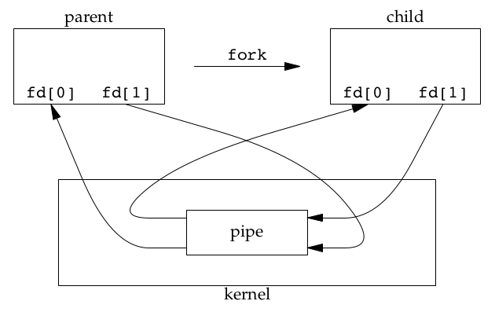
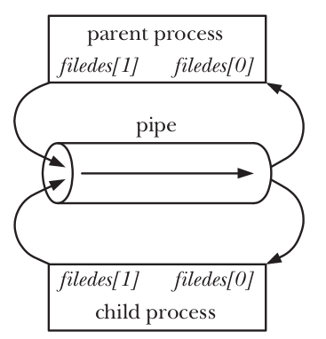
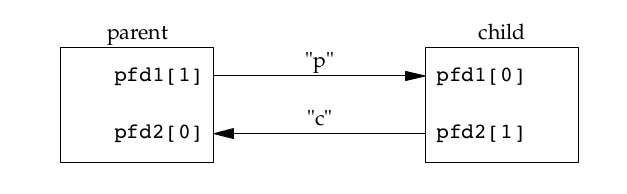
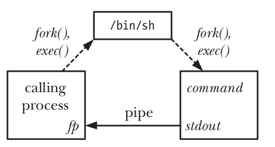
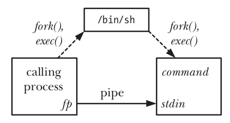
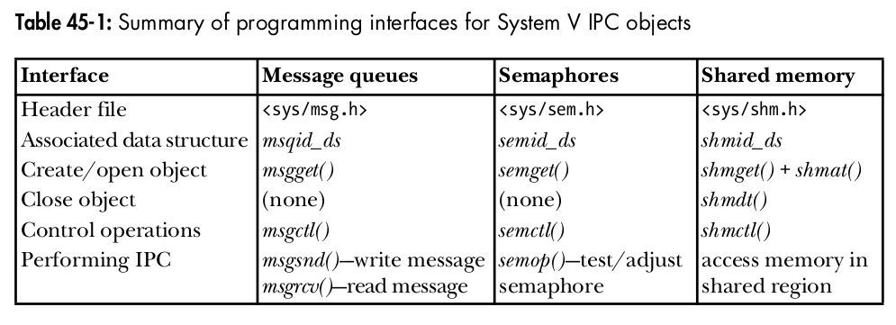

# PIPE

> ***A pipe is an IPC (Inter-Process Communication) mechanism that allows one process to transmit a byte stream to another process via the kernel.***

```text
          Process A                         Process B
          │                                  │
          │ write()                          │ read()
          │                                  │
          ▼                                  ▲
          ┌──────────────────────────────────────────┐
          │                  KERNEL                  │
          │                                          │
          │             PIPE BUFFER                  │
          │                                          │
          └──────────────────────────────────────────┘
```

## Why do PIPE exist?

Each process has its own virtual address space:

```text
Process A                  Process B

┌─────────────┐            ┌─────────────┐
│ Stack       │            │ Stack       │
│ Heap        │            │ Heap        │
│ Data        │            │ Data        │
│ Code        │            │ Code        │
└─────────────┘            └─────────────┘
```

Process A cannot simply go ahead and do:

```c
B->variable = 100;
```

because the variable resides in B's address space. It requires an intermediary mechanism. And that is **Pipe**.

**What is the pipe suitable for?**

|suited for|------|not suited for|
|:---|:---|:---|
|shell pipelines||complex message structures|
|parent-child communication||random access|
|simple producer-consumer scenarios||large shared datasets|
|passing stdin/stdout||multiple clients requiring flexible communication|
|data streaming|||

Pipe is primarily suitable for related processes, particularly those linked via `fork()`.

**Library**

```c
#include <unistd.h>
```

**Some APIs of Pipe**

|API|---|Effect|Return|
|:---|:---|:---|:---|
|`pipe()`||open the pipe|0 if successfull|
||||-1 if not|
|`close()`||close the file discription|0 if successfull|
||||-1 if not|
|`write()`||write data to pipe|the number of bytes written if success|
||||-1 if not|
|`read()`||read data from pipe|the number of bytes read if success|
||||-1 if not|

**Create pipe**

After Pipe success, two file descriptors are stored in `fd`;  

```text
fd[0] = read end
fd[1] = write end
```

***The output of fd[1] is the input for fd[0].***



**pipe and fork**

```c
int fd[2];

pipe(fd);

pid_t pid = fork();
```

Normally, we use a pipe to allow communication between two processes. To connect two processes using a pipe, we follow the `pipe()` call with a call to `fork()`. During a `fork()`, the child process inherits copies of its parent’s file descriptors, as show below:



Data can travel only one direction through a pipe. If we want to transfer data between parent and child process, we have to use two pipe.



## Pipe has limited capacity

If pipe is full, `write()` can be blocked.

```c
const char *msg = "HELLO HELLO HELLO HELLO HELLO HELLO";
while (1)
{
    write(fd[1], msg, strlen(msg));
    printf("write %d time\n", n);
    n++;
}
```

```text
write 1868 time
write 1869 time
write 1870 time
write 1871 time
^C
```

I can write a `msg` string to pipe 1871 times then I can't. Because the default maximum size of pipe is 64Kb, size of `msg` is 35 byte and I write 1871 times, total of size is 65485 byte. It is 64kb.

## Blocking

A different example about the child process does not close the write end, so, instead the parent have done writing but the child still waiting for read. It is **blocking**.

```c
int main(void)
{
    int fd1[2];

    if (pipe(fd1) == -1)
    {
        perror("pipe");
        exit(EXIT_FAILURE);
    }

    pid_t pid = fork();

    if (pid == -1)
    {
        perror("fork");
        exit(EXIT_FAILURE);
    }

    if (pid == 0) /* child process */
    {
        /* child process does not close the write end
           child process simply read and can be blocked
        */
        // close(fd1[1]);
        printf("Before read\n");
        char buffer[100];

        size_t n;

        while ((n = read(fd1[0], buffer, sizeof(buffer) - 1)) > 0)
        {
            printf("reading...\n");
        }

        printf("After read\n");

        buffer[n] = '\0';
        printf("%lu Child received: %s\n", n, buffer);

        close(fd1[0]);
    }
    else /* parent process */
    {
        /* parent process close the read end
           parent process simply write
        */
        close(fd1[0]);
        sleep(5);
        const char *msg = "Hello from Parent";
        write(fd1[1], msg, strlen(msg));
        close(fd1[1]);
        wait(NULL);
    }
    return 0;
}
```

```text
Before read
reading...
^C
```

Why? Because the parent process has already closed both the write and read ends of the pipe, but the child process retains the write end, the kernel perceives that a writer still exists. If the child process attempts to read from the empty pipe, the `read()` function blocks the process, waiting for the writer to provide data; however, the write end is held by the child process itself. This results in the child process hanging indefinitely.

>As we know, *pipe* has a limited capacity, when we write up to limit of pipe, `write()` will block until data has been removed from the pipe by some reading process.

## SIGPIPE

*SIGPIPE* is a signal sent when we writing data to a pipe that has no read end.

Normally, If the process does not handle this signal, the default behavior for `SIGPIPE` is to terminate the process.

If we ignor or create function to handle it. we can see the return value:

Example:

```c
void signal_handler(int sig)
{
    if (sig == SIGPIPE)
    {
        printf("write fail with exit signal: SIGPIPE\n");
    }
    return;
}

int main(int argc, char *argv[])
{
    signal(SIGPIPE, signal_handler);
    int fd[2];

    if (pipe(fd) == -1)
    {
        perror("pipe");
        exit(EXIT_FAILURE);
    }

    close(fd[0]);

    const char *msg = "HELLOOOOO";
    /*
    write return the number of byte written
    return -1 if error
    */
    int ret = write(fd[1], msg, strlen(msg));
    printf("write done with return: %d\n", ret);
    
    return 0;
}
```

```text
write fail with exit signal: SIGPIPE
write done with return: -1
```

## Deadlock

If we want to establish two-way communication, we must use two pipes.
But it can lead to deadlock.

Example:

```c
/* parent write big data and read from child */
write(fd1[1], big_data, ...);
read(fd2[0], ...);

/* child write big data and read from parent */
write(fd2[1], big_data, ...);
read(fd1[0], ...);
```

Both parent and child write big data to pipe before read, if it lead to full pipe, both are waiting for the other to read it. This is ***Deadlock in IPC.***

## Using `pipe` for Synchronization

We can use `pipe` as a signal to synchronization process. Parent process will close the write end and `read()` to wait from pipe. Child process will close the read end, then do something (*do not write anything to pipe*). After done, the child process will close its write end. At this time, parent process can run because there are no write end and `read()` function return 0 (no write end).

Example:

```c
int main(int argc, char *argv[])
{
    int p_fd[2];

    printf("parent start\n");

    /* create pipe */
    if(pipe(p_fd) != 0)
    {
        perror("pipe");
        return -1;
    }

    switch (fork())
    {
    case -1:
        /* error */
        perror("fork");
        return -2;
        break;

    case 0:
        /* child close the read end */
        if(close(p_fd[0]) == -1)
        {
            perror("child close");
            exit(-3);
        }
        /* do something */
        sleep(5);

        printf("child closed the pipe\n");

        /* close the write end */
        if(close(p_fd[1]) == -1)
        {
            perror("child close");
            exit(-3);
        }

        exit(12);
        break;
    
    default:
        break;
    }

    /* parent close the write end */
    if(close(p_fd[1]) == -1)
    {
        perror("parent close");
        return -4;
    }

    char dummy[100];

    /* parent use read to wait for the child */
    read(p_fd[0], &dummy, 100);

    printf("parent ready to run\n");

    return 0;
}
```

```text
parent start
child closed the pipe
parent ready to run
```

# popen and pclose

If we want to run a command and communicate with it via pipe.

`popen() = process + pipe + open`

`popen` create a pipe, and then fork a child process that exec a shell which turn create a child process to execute command. The mode argument detemine whether the calling process will read from pipe or write to it.

Prototype:

```c
FILE *popen (const char *command, const char *type)
/* return:
file pointer if OK
NULL if error
*/

/* type:
r: the file pointer is connected to the standard output of command
w: the file pointer is connected to the standard input of command
*/

int pclose (FILE *stream)
/* Returns:
termination status of command
or −1 on error
*/
```

  
Result of `fp = popen(command, "r")`

  
Result of `fp = popen(command, "w")`

Example read from command:

```c
/* using popen to run command passed via argument *argv[] */
int main(int argc, char *argv[])
{
    FILE *file;
    /* run command */
    file = popen("ls -l", "r");

    if(file == NULL)
    {
        perror("popen");
        return -1;
    }

    char buffer[1024];

    /* print out the result */
    while((fgets(buffer, sizeof(buffer), file)))
    {
        printf("%s", buffer);
    }

    /* close */
    pclose(file);
    return 0;
}
```

```text
document.txt
image-1.png
image-2.png
image-3.png
image-4.png
image-5.png
image.png
reader
README.md
Screenshot from 2026-09-11 15-27-51.png
test
test.c
writer
```

Example write to command:

```c
/* using popen to run command passed via argument *argv[] */
int main(int argc, char *argv[])
{
    FILE *file;
    /* run command */
    file = popen("grep Hello", "w");

    if (file == NULL)
    {
        perror("popen");
        return -1;
    }

    fprintf(file, "Hello world!\n");
    fprintf(file, "This is Linux\n");
    fprintf(file, "Hello world again!\n");

    /* close */
    pclose(file);
    return 0;
}
```

```text
Hello world!
Hello world again!
```

# FIFOs

In Linux, FIFO is a IPC called **Named Pipe**

Unlike the normal pipe, FIFO has a name in filesystem.  
`/tmp/myfifo`  
and two processes can communicate without having the parent-child relationship.

Prototype:

```c
#include <sys/stat.h>

int mkfifo (const char *path, __mode_t mode)
```

The *path* is the name of the FIFO to be create, and the *mode* option is used to specify a permission *mode* in the same way as for the *chmod* command.

Conceptually:

```text
Filesystem
    │
    └── /tmp/myfifo
             │
             ▼
       Kernel FIFO object
             │
        ┌────┴────┐
        ▼         ▼
      writer     reader
```

Open FIFO:

```c
int fd = open("/tmp/myfifo", O_WRONLY); /* writer */

int fd = open("/tmp/myfifo", O_RDONLY); /* reader */
```

## Block in FIFOs

***Writer, openning the FIFO, will typically block until the reader open the FIFO.***

```text
Writer
  │
  │ open(O_WRONLY)
  ▼
BLOCK
  │
  │ wait reader
  │
  ▼
Reader appear
  │
  ▼
open() complete
```

What really happened?

Writer runs to `open` command and wait there because `open` command has not yet returned the result. Then reader call `open`, at this time, the FIFO is enough writer and reader so both can continute.

If we don't want to block when using `open`, we can use:

```c
open("/tmp/myfifo", O_WRONLY | O_NONBLOCK);
```

## Example

This example will reproduce communication between 2 processes:  
The writer:

- write data to fifo named fifo_A_to_B
- read data from fifo named fifo_B_to_A

The reader:

- read data from fifo named fifo_A_to_B
- write data to fifo named fifo_B_to_A

Process A is the writer:

```c
int main(int argc, char *argv[])
{
    /* create fifo if it does not exist */
    mkfifo("/tmp/fifo_A_to_B", 0666);

    char buffer[512];                      /* buffer save data received */
    const char *msg = "Hello from writer"; /* data to send */

    /* open fifo */
    int fd = open("/tmp/fifo_A_to_B", O_WRONLY);
    int fd1 = open("/tmp/fifo_B_to_A", O_RDONLY);

    /* the loop comunication */
    while (1)
    {
        write(fd, msg, strlen(msg));

        int n = read(fd1, buffer, sizeof(buffer) - 1);

        buffer[n] = '\0';

        printf("%s\n", buffer);
        sleep(1); /* slow */
    }

    close(fd);
    close(fd1);
    return 0;
}
```

Process B is the reader

```c
int main(int argc, char *argv[])
{
    /* create fifo if it does not exist */
    mkfifo("/tmp/fifo_B_to_A", 0666);

    char buffer[512];                      /* buffer save data received */
    const char *msg = "Hello from reader"; /* data to send */

    /* open fifo */
    int fd = open("/tmp/fifo_A_to_B", O_RDONLY);
    int fd1 = open("/tmp/fifo_B_to_A", O_WRONLY);

    /* the loop comunication */
    while (1)
    {
        int n = read(fd, buffer, sizeof(buffer) - 1);

        buffer[n] = '\0';

        printf("%s\n", buffer);

        write(fd1, msg, strlen(msg));
        sleep(1); /* slow */
    }

    close(fd);
    close(fd1);
    return 0;
}
```

|Process A|Process B|
|:---|:---|
|Hello from reader|Hello from writer|
|Hello from reader|Hello from writer|
|Hello from reader|Hello from writer|
|Hello from reader|Hello from writer|

# INTRODUCTION TO SYSTEM V IPC

```text
                 System V
                     │
                     ▼
                 key_t key
                     │
           ┌─────────┼─────────┐
           ▼         ▼         ▼
        msgget()  semget()  shmget()
           │         │         │
           ▼         ▼         ▼
         msgid     semid     shmid
```



## Keys and IPC Identifiers

***Key*** is a value used to identify Tthe IPC object that the process wants to create or access.

***IPC ID*** is used to perform after the object is found.

**command to check Message Queue**

```bash
ipcs -q
```

IPC keys is an interger number used to determine the object which process wants to access.

Example: `key_t key = 1234;`

**How do we provide a unique key, there are three possibilities:**

- Randomly choose some interger key values, which is typically placed in header file included by all programs using the IPC object. we may accidentally choose a value used by another application.
- Specify the *IPC_PRIVATE* constant as the key value to the get call when creating the IPC object, which always results in the creation of a new IPC object that is guaranteed to have a unique key.
- Employ the `ftok()` function to generate a (likely unique) key.

Using either *IPC_PRIVATE* or `ftok()` is the usual technique.

**Create unique key with *IPC_PRIVATE***

```c
int msgid = msgget(IPC_PRIVATE, 0666);
```

This technique is especially useful in multiprocess applications where the parent process creates the IPC object prior to performing a fork(), with the result that the child inherits the identifier of the IPC object.

**Create using `ftok()`**

```c
key_t ftok(const char *pathname, int proj_id);
```

Return:

- On success, the generated key_t value is returned.
- On failure -1 is returned.

After we have the key, we can use `msgget(), semget(), shmget()` to gain the IPC ID and use it to access to the object.

## Permission Structure

```c
/* Data structure used to pass permission information to IPC operations.
   It follows the kernel ipc64_perm size so the syscall can be made directly
   without temporary buffer copy.  However, since glibc defines the MODE
   field as mode_t per POSIX definition (BZ#18231), it omits the __PAD1 field
   (since glibc does not export mode_t as 16-bit for any architecture).  */
struct ipc_perm
{
   __key_t __key;            /* Key.  */
   __uid_t uid;              /* Owner's user ID.  */
   __gid_t gid;              /* Owner's group ID.  */
   __uid_t cuid;             /* Creator's user ID.  */
   __gid_t cgid;             /* Creator's group ID.  */
   __mode_t mode;            /* Read/write permission.  */
   unsigned short int __seq; /* Sequence number.  */
   unsigned short int __pad2;
   __syscall_ulong_t __glibc_reserved1;
   __syscall_ulong_t __glibc_reserved2;
};
```

```text
Message Queue
┌──────────────────────────┐
│ owner UID                │
│ group GID                │
│ permission mode          │
│ creator UID              │
│ creator GID              │
│ queue size               │
│ number of messages       │
│ timestamps               │
│ ...                      │
└──────────────────────────┘
```

`ipc_perm` is a structure containing information that the kernel uses to manage the ownership and access control of an IPC object.

Example we have:

|Message Queue|
|:---|
|UID|
|GID|
|mode = 0666|

**What does `0666` actually mean?**

Each number is ​​represent for an object's permission when access to a message queue.

|0|6|6|6|
|:---|:---|:---|:---|
|other mode|user|group|others|

```text
rwx rwx rwx = 111 111 111
rw- rw- rw- = 110 110 110
rwx --- --- = 111 000 000

and so on...

rwx = 111 in binary = 7
rw- = 110 in binary = 6
r-x = 101 in binary = 5
r-- = 100 in binary = 4
```

Where of course, r stands for read and w for write then x means execute.  
So `6` is read and write.

## Configuration Limits

Since System V IPC objects consume system resources, the kernel places various limits on each class of IPC object in order to prevent resources from being exhausted.

**Some important limitations**

```c
MSGMAX      /* the maximum size of a message */
MSGMNB      /* the maximum size of a message queue */
MSGMNI      /* limits the number message queues
               that a system/IPC namespace can have */
```

Similarly, Semaphore and Shared Memory also have limits.

```c
/* Semaphore */ 
SEMMSL
SEMMNS
SEMOPM
SEMMNI

/* Shared Memory */
SHMMAX
SHMMIN
SHMALL
SHMMNI
```

## Command with IPC

### see all IPC

```bash
ipcs
```

```text
------ Message Queues --------
key        msqid      owner      perms      used-bytes   messages    

------ Shared Memory Segments --------
key        shmid      owner      perms      bytes      nattch     status      

------ Semaphore Arrays --------
key        semid      owner      perms      nsems  
```

### see limit

```bash
ipcs -l
```

```text
------ Messages Limits --------
max queues system wide = 32000
max size of message (bytes) = 8192
default max size of queue (bytes) = 16384

------ Shared Memory Limits --------
max number of segments = 4096
max seg size (kbytes) = 18014398509465599
max total shared memory (kbytes) = 18446744073709551612
min seg size (bytes) = 1

------ Semaphore Limits --------
max number of arrays = 32000
max semaphores per array = 32000
max semaphores system wide = 1024000000
max ops per semop call = 500
semaphore max value = 32767
```

### delete Message Queue

```bash
ipcrm -q <msg_id>
```

# POSIX Message Queue

**LIBRARY**

```c
#include <mqueue.h>
```

Some APIs in Message Queue:

|APIs|----|Effect|
|:---|:---|:---|
|`mq_open()`||create/open message queue|
|`mq_close()`||close the connection to queue|
|`mq_unlink()`||removes a message queue name and marks it for deletion|
|`mq_send()`||send message to queue|
|`mq_receive()`||read message from queue|
|`mq_getattr()`|||
|`mq_setattr()`|||
|`mq_notify()`||subscribe to receive message notifications from a queue.|

**Life circle of message queue:**

```text
mq_open()
    ↓
mq_send() / mq_receive()
    ↓
mq_getattr() / mq_setattr()
    ↓
mq_close()
    ↓
mq_unlink()
```

## mp_open()

If we want to ***open*** the exsited queue, use:

```c
mqd_t mq_open(const char *name, int oflag);
```

And if we want to ***create*** queue, use:

```c
mqd_t mq_open(const char *name, int oflag, mode_t mode,
                     struct mq_attr *attr);
```

### Some commonly flag

|Flag|----|Mean|
|:---|:---|:---|
|`O_RDONLY`||only read data|
|`O_WRONLY`||only write data|
|`O_RDWR`||can read and write data|
|`O_CREAT`||create queue if it does not exist|
|`O_EXCL`||if queue already exist, `mq_open` will return with error `EEXIST`|
|`O_NONBLOCK`||no blocking when queue is empty or full|

### Permission

`mode` argument is a number that determine the permission when the process open the queue.

Example: `mode = 0666`

Each number is ​​represent for an object's permission when access to a message queue.

|0|6|6|6|
|:---|:---|:---|:---|
|other mode|user|group|others|

```text
rwx rwx rwx = 111 111 111
rw- rw- rw- = 110 110 110
rwx --- --- = 111 000 000

and so on...

rwx = 111 in binary = 7
rw- = 110 in binary = 6
r-x = 101 in binary = 5
r-- = 100 in binary = 4
```

Where of course, `r` stands for read and `w` for write then `x` means execute.  
So `6` is read and write.

### Attribute

This is the queue configuration when creating a new queue.

```c
struct mq_attr attr;
```

```c
struct mq_attr
{
  __syscall_slong_t mq_flags; /* Message queue flags.  */
  __syscall_slong_t mq_maxmsg; /* Maximum number of messages.  */
  __syscall_slong_t mq_msgsize; /* Maximum message size.  */
  __syscall_slong_t mq_curmsgs; /* Number of messages currently queued.  */
};
```

|Element|----|Mean|
|:---|:---|:---|
|`mq_flags`|||
|`mq_maxmsg`||the maximum number of messages in queue|
|`mq_msgsize`||the maximum size of each message|
|`mq_curmsgs`||the number of current messages|

## mq_notify()

Register to have the kernel notify the process when a new message appears in the queue.

Prototype:

```c
int mq_notify(mqd_t mqdes, const struct sigevent *notification);
```

Return:

- 0 : success
- 1 : error

The `sigev_notify` field of the `sigevent` structure (pointed to by `sevp`) determines how notification is performed. This field takes one of the following values:

||||
|:---|:---|:---|
|`SIGEV_SIGNAL`||The kernel sends a signal to the process when a notification occurs.|
|`SIGEV_THREAD`||When the message is delivered, call `sigev_notify_function` as if it were the start function of a new thread.|
|`SIGEV_NONE`||Do not send a notification.|

Example:

```c
/*SIGEV_SIGNAL*/
struct sigevent sev;

sev.sigev_notify = SIGEV_SIGNAL;
sev.sigev_signo = SIGUSR1;

mq_notify(mq, &sev);
/*--------------------------------*/

/*SIGEV_THREAD*/
void notification_function(union sigval value)
{
    printf("New message!\n");
}

struct sigevent sev = {0};

sev.sigev_notify = SIGEV_THREAD;
sev.sigev_notify_function = notification_function;

mq_notify(mq, &sev);
/*--------------------------------*/

/*SIGEV_NONE*/
sev.sigev_notify = SIGEV_NONE;
/*--------------------------------*/
```

# POSIX Shared Memory

```bash
ls -l /dev/shm
```

| API            | Function                          |
| -------------- | --------------------------------- |
| `shm_open()`   | Create/open POSIX shared-memory object |
| `ftruncate()`  | Set object size                   |
| `mmap()`       | Map object to virtual address     |
| `munmap()`     | Unmap from process                |
| `close()`      | Close file descriptor             |
| `shm_unlink()` | Remove shared-memory object name  |

Flow:

```text
            shm_open
                ↓
            ftruncate
                ↓
              mmap
                ↓
        USE SHARED MEMORY
                ↓
              munmap
                ↓
              close
                ↓
            shm_unlink
```

Comparison of System V and POSIX

```text
System V                    POSIX

shmget()              ≈     shm_open()
   ↓
shmat()                ≈     mmap()
   ↓
shmdt()                ≈     munmap()
   ↓
shmctl(IPC_RMID)      ≈     shm_unlink()
```

## shm_open()

```text
                 shm_open()
                     │
        ┌────────────┼────────────┐
        ▼            ▼            ▼
      name         oflag         mode
        │            │            │
   "/my_shm"   O_CREAT|O_RDWR    0666
```

```text
User process
     │
     │ shm_open("/my_shm", ...)
     ▼
  syscall / libc
     │
     ▼
   Kernel
     │
     ├── find SHM object
     │
     ├── if O_CREAT:
     │      create if it does not exist
     │
     ├── check permission
     │
     ├── create/open file description
     │
     └── return fd
     │
     ▼
User process
     │
     └── fd = 3
```

## mmap()

Prototype:

```c
void *mmap(
    void *addr,
    size_t length,
    int prot,
    int flags,
    int fd,
    off_t offset
);
```

### addr

addr = `NULL` means the kernel automatically selects a suitable virtual address.

### flags = MAP_SHARED and flags = MAP_PRIVATE

These are two extremely important flags. The core difference:

```text
MAP_SHARED
    ↓
Changes made by the process are visible
to other mappings of the same object.

MAP_PRIVATE
    ↓
Changes made by the process are not shared
in that way → copy-on-write.
```

***MAP_SHARED***

> Modifications to a mapping are shared with other mappings of the same object.

```text
Process A                    Process B

   ptrA                         ptrB
     │                            │
     │                            │
     └──────────┐    ┌────────────┘
                │    │
                ▼    ▼
          +----------------+
          | shared pages   |
          |                |
          | value = 100    |
          +----------------+
```

***MAP_PRIVATE***

Initial:

```text
Process A                    Process B

   ptrA                         ptrB
     │                            │
     │                            │
     └──────────┐    ┌────────────┘
                │    │
                ▼    ▼
          +----------------+
          | original page  |
          | value = 100    |
          +----------------+
```

Both initially read `100`, but A recorded:

```c
*ptrA = 200;
```

The kernel does not want A to modify the shared page according to MAP_PRIVATE semantics. It performs `Copy-on-Write`.

Before write:

```text
A ──────┐
        │
        ▼
   +---------+
   | page 100 |
   +---------+
        ▲
        │
B ──────┘
```

When A write:

```text
A ─────────> +---------+
             | page 200 |
             +---------+

B ─────────> +---------+
             | page 100 |
             +---------+
```

***MAP_SHARED | MAP_ANONYMOUS***

```text
mmap(MAP_SHARED | MAP_ANONYMOUS)
              │
              ▼
          fork()
           /   \
          /     \
       Parent  Child
```

### Distinguish between virtual memory, physical memory, and page faults, and specifically explain why `mmap()` allows mapping a region larger than the available RAM.

Let's assume my computer has `RAM = 8 GB`

I do:

```text
void *p = mmap(
    NULL,
    4ULL * 1024 * 1024 * 1024,
    PROT_READ | PROT_WRITE,
    MAP_PRIVATE | MAP_ANONYMOUS,
    -1,
    0
);
```

I just requested a 4 GB mapping.

> That does not mean the kernel immediately takes 4 GB of RAM.

Initially, one can visualize:

``` text
Virtual Address Space
+--------------------------------+
|                                |
|       4 GB mapped region       |
|                                |
+--------------------------------+

Physical RAM
+--------------------------------+
|      Not yet necessary 4 GB    |
+--------------------------------+
```

> `mmap()` first establishes a virtual memory mapping.

**When is RAM actually used?**

When the CPU actually accesses a page.

```text
virtual address
      |
      v
+-------------+
| Page Table  |
+-------------+
      |
      v
Has the physical page been created yet?
      |
   +--+--+
   |     |
  YES    NO
   |     |
   |     v
   |  PAGE FAULT
   |     |
   |     v
   |  kernel map page
   |     |
   +-----+
      |
      v
physical RAM
```

**A "page fault" is not necessarily an error.**

There are three types of concepts:

- **Minor/valid page fault**

> The kernel can handle it.  
For example, a page that has not yet been mapped to physical RAM but has a valid mapping.

- **Major page fault**

> The kernel must retrieve data from backing storage, such as a disk or file.

- **Invalid page fault**

> Invalid memory access: `SIGSEGV`

### SIGSEGV vs SIGBUS

Suppose :

```c
ftruncate(fd, 4096);
```

Object just have:

> 4096 bytes

but we map:

```c
mmap(NULL, 8192, ...);
```

A mapping can be created, but if you access an area beyond the backing object:

```c
ptr[5000] = 'A';
```

Maybe receive:

> SIGBUS

This differs from simply accessing an address that is not part of the mapping at all, which typically results in:

>SIGSEGV

```text
SIGSEGV
    ↓
memory access invalid
    ↓
e.g., non-existent mapping / incorrect permissions
```

while:

```text
SIGBUS
    ↓
mapping exists but backing object
Corresponding data cannot be provided
```

# POSIX Semaphore

**What is POSIX semaphore?**

> A POSIX semaphore is a counter used for synchronization between threads or processes.

```text
             semaphore
                 |
                 v
             +-------+
             | value |
             |   2   |
             +-------+
              /     \
             /       \
       sem_wait    sem_post
          |             |
       value--        value++
```

**Two types of POSIX semaphores**

***A. Unnamed semaphore***

```c
#include <semaphore.h>

int sem_init(sem_t *sem, int pshared, unsigned int value);

int sem_destroy(sem_t *sem);

int sem_wait(sem_t *sem);

int sem_trywait(sem_t *sem);

int sem_timedwait(sem_t *sem,
                  const struct timespec *abs_timeout);

int sem_post(sem_t *sem);

int sem_getvalue(sem_t *sem, int *sval);
```

Create directly in memory:

```c
sem_t sem;

sem_init(&sem, 0, 1);
```

Used primarily for:

- thread ↔ thread
- process ↔ process, if the semaphore is placed in shared memory

***B. Named semaphore***

```c
sem_t *sem_open(const char *name,
                int oflag,
                ...);

int sem_close(sem_t *sem);

int sem_unlink(const char *name);
```

Semaphore system name:

```c
sem_open("/my_sem", O_CREAT, 0666, 1);
```

Other processes can open the same semaphore:

```c
sem_open("/my_sem", 0);
```

## Unnamed semaphore

### sem_init()

```text
             sem_init()
                |
       +--------+--------+
       |        |        |
      sem     pshared   value
```

> pshared = 0: The semaphore is used to synchronize threads within the same process.
> pshared != 0: The semaphore can be used for synchronization between processes.

Example with `pshared != 0`:

The semaphore must be placed in a memory region where both processes map to the same physical pages.

```c
sem_t *sem;

sem = mmap(
    NULL,
    sizeof(sem_t),
    PROT_READ | PROT_WRITE,
    MAP_SHARED | MAP_ANONYMOUS,
    -1,
    0
);

sem_init(sem, 1, 0);

pid_t pid = fork();
```

After `mmap` we have `semaphore` in the shared memory which processes can observe.

```text
             Shared memory
          ┌─────────────────┐
          │                 │
          │     sem_t       │
          │                 │
          └────────┬────────┘
                   │
             same physical
                 pages
             /           \
            /             \
           v               v

        Parent           Child
      sem_wait()       sem_post()
```

**Why we see `MAP_ANONYMOUS` and `-1` in the `mmap` function?**

Typically, `mmap()` maps a file into virtual memory, but `MAP_ANONYMOUS` changes this behavior.
Using `MAP_ANONYMOUS` means:

> The mapping is not backed by any file.

It is a memory region provided to the process by the kernel; consequently, the `fd` (file descriptor) argument is irrelevant.

> In this parent-child example, `MAP_ANONYMOUS | MAP_SHARED` is a convenient way to create file-less shared memory, especially for processes related via `fork()`.
>> However, if you have two independent processes started separately—without a shared `fork()` relationship—an *anonymous mapping* is not a suitable method for them to access the same memory region. In such cases, POSIX shared memory ***(shm_open + mmap(MAP_SHARED))*** or System V shared memory is typically used to allow both processes to open or attach to the same shared memory area.

### sem_trywait()

```text
sem_wait()
    |
    +-- value > 0 → decrement → return 0
    |
    +-- value == 0 → BLOCK


sem_trywait()
    |
    +-- value > 0 → decrement → return 0
    |
    +-- value == 0 → NON BLOCK
                     |
                     +→ return -1
                        errno = EAGAIN
```

### sem_timedwait()

Prototype:

```c
int sem_timedwait(
    sem_t *sem,
    const struct timespec *abs_timeout
);
```

It lies between:

```text
sem_wait()        sem_trywait()
     |                  |
     |                  |
block forever       non block


sem_timedwait(): wait for a period of time
```

> A common point of confusion is `abs_timeout`, where `abs` stands for "absolute." It does not mean "wait for 5 seconds," but rather "wait until `CLOCK_REALTIME` reaches this timestamp."

Example:

```c
struct timespec ts;

clock_gettime(CLOCK_REALTIME, &ts);

ts.tv_sec += 5;

sem_timedwait(&sem, &ts);
```

If the semaphore is still not available after that point: `errno == ETIMEDOUT`.

## Named Semaphore

```text
Unnamed                    Named

sem_init()                 sem_open()
sem_destroy()              sem_close()
                           sem_unlink()
```

### sem_open()

Prototype:

```c
sem_t *sem;

sem = sem_open("/my_sem", O_CREAT, 0666, value);
```

The `value` parameter only takes effect during creation. If `/my_sem` does not yet exist, it is set to 5; however, if `/my_sem` already exists, it is not reset to 5.

***Lifecycle:***

```text
sem_open()
    ↓
OPEN
    ↓
sem_wait / sem_post
    ↓
sem_close()
    ↓
process no longer uses it

sem_unlink()
    ↓
name removed
```

## Semaphore trong Producer–Consumer

Suppose buffer has: `capacity = 5`

We have:

```c
sem_t empty;
sem_t full;
```

Init:

```c
sem_init(&empty, 0, 5); /* empty = number of empty slot */
sem_init(&full, 0, 0); /* full  = number of current slot */
```

Initially:

```text
Buffer
+---+---+---+---+---+
|   |   |   |   |   |
+---+---+---+---+---+
 ^
 empty = 5
 full  = 0
```

Producer:

```c
sem_wait(&empty);
sem_wait(&mutex);

put_item();

sem_post(&mutex);
sem_post(&full);
```

Consumer:

```c
sem_wait(&full);
sem_wait(&mutex);

get_item();

sem_post(&mutex);
sem_post(&empty);
```

- If the buffer is full: `empty = 0`, producer calls `sem_wait(&empty);` → blocks.

- If the buffer is empty: `full = 0`, consumer calls `sem_wait(&full);` → blocks.

This is the exact semaphore logic you encountered when studying shared memory and semaphores.

# POSIX Signal

**What is a signal?**

In Linux, a signal is an asynchronous notification mechanism between the kernel and a process.

Example when we run a program:

```bash
./test
```

Then press `Ctrl+C`, the terminal does not directly call any function in your C program. It causes the process to receive: `SIGINT`

The kernel then handles this signal.

Default behavior:

>SIGINT -> terminate process

## A signal has three important states.

A signal for a process can be viewed in terms of these stages:

```text
            Generated
                | 
                v
            Pending
                | 
                v
            Delivered
```

A crucial point:

>"Generated" does not mean the handler executes immediately.

A signal can be blocked, in which case it becomes pending.

## Signal Disposition

Every signal has a disposition—that is, the action the process takes when it receives that signal.

There are three main types:

```text
        signal
            | 
            +---- default action
            | 
            +---- ignore
            | 
            +---- custom handler
```

If we `ignore` or write a signal handler, we must add it to the signal.

Example we add `handler` function to signal `SIGINT`:

```c
signal(SIGINT, handler);
```

Then we press `Ctrl+C`, the program will not terminate but run the `handler` function.

Model:

```text
                    Kernel
                      |
                 SIGINT generated
                      |
                      v
              +---------------+
              | process signal |
              | disposition    |
              +---------------+
                      |
                      v
                   handler()
```

## Unreliable Signals

This is an important part of the history of Unix signals.

Traditional signals once operated under semantics known as "unreliable signals."

The basic idea:

> Signals might not be preserved as expected if multiple signals occur while the handler is currently processing.

If a signal is in a pending state and other similar signals arrive, they will not be queued like messages in a message queue.

```text
             SIGINT
                |
                v
             pending

             SIGINT
                |
                v
           already pending

             SIGINT
                |
                v
          already pending
```

## Interrupted System Calls

If a process is blocked while making a system call and a signal is sent to it, the blocked state will be interrupted, and the function will return an error code of -1 (if applicable).

Example:

```c
void signal_handler(int sig)
{
    printf("signal SIGINT have received\n");
}

int main(int argc, char *argv[])
{
    signal(SIGINT, signal_handler);

    printf("process is running\n");

    char buf[256];

    int ret = read(STDIN_FILENO, buf, sizeof(buf));

    if (ret == -1)
    {
        printf("read failed\n");
    }

    return 0;
}
```

```text
process is running
^Csignal SIGINT have received
```

When the process is running, we press `Ctrl+C` to send signal `SIGINT` to the process. The block state when `read` is interrupted.

## sigaction()

> NOTE:  
> A signal can interrupt a system call. The subsequent behavior depends on:
>
> - the type of system call
> - the signal disposition
> - SA_RESTART
> - kernel/libc semantics

Example:

```c
struct sigaction sa;

sa.sa_handler = handler;
sigemptyset(&sa.sa_mask);
sa.sa_flags = SA_RESTART;

sigaction(SIGUSR1, &sa, NULL);
```

`SA_RESTART` requests some interrupted system calls auto restart.

## Reentrant Functions

> A function is reentrant if it can be called again before a previous invocation has completed and still operate correctly.

Not all functions are safe to use within a signal handler.

A crucial rule:

> Only call functions defined by POSIX as async-signal-safe within a signal handler.  
> Example:
>
> - write()
> - _exit()
> - kill()
> - signal()

Note: `printf()` is very easy to use in ***demos*** but is not a safe choice for production signal handlers.

**Why is printf() dangerous?**

If a signal occurs while a process is writing data to the `stdout` buffer, the write operation is interrupted; if the signal handler subsequently calls `printf()`, the buffer may be overwritten, resulting in unintended output.

## volatile sig_atomic_t

When a signal occurs, the handler function simply needs to set a `flag` variable to 1 to notify the main program for processing, rather than performing complex tasks within the function itself.

Example:

```c
volatile sig_atomic_t flag = 0;

void handler(int sig)
{
    flag = 1;
}

int main()
{
    while (flag)
    {
        /* do work */
        flag = 0;
    }
}
```

## Reliable Signals

### kill() / raise()

```c
kill(pid, signal);
```

Send `signal` to the process with PID = pid.

|pid||Meaning|
|---|---|---|
|> 0||Send to the specific process|
|0||Send to the current process group|
|< -1||Send to process group with PGID|
|-1||Sent to all processes that the caller has permission to signal|

**Compare `kill()` with `raise()`:**

|                  | `kill()`             | `raise()`                 |
| ---------------- | -------------------- | ------------------------- |
| Sent to          | process/group        | the process itself        |
| Uses PID         | Yes                  | No                        |
| Inter-process IPC| Yes                  | Not the primary purpose   |
| Example          | `kill(pid, SIGUSR1)` | `raise(SIGUSR1)`          |

### alarm() / pause()

**alarm**

> alarm() : Timer using signals.

```c
#include <unistd.h>

unsigned int alarm(unsigned int seconds);
/* The return value is the number of seconds remaining
                 for the previous alarm, if any. */

/* Example */
alarm(5);

/* After approximately 5 seconds,
 * the process will receive a `SIGALRM`.
 */
```

> alarm() has only one timer.

```c
/* if before */
alarm(10);
/* then */
alarm(3);
/* The 10-second timer was replaced by a 3-second timer. */
```

> Use `alarm(0)` to cancel the current alarm.

**pause**

> `pause()` puts the process to sleep until a signal is received and its handler is executed.

Prototype:

```c
#include <unistd.h>

int pause(void);
```

**Combine `alarm() + pause()`**

```c
void handler(int sig)
{
    printf("SIGALRM received\n");
}

int main(void)
{
    signal(SIGALRM, handler);

    alarm(5);

    printf("waiting...\n");

    pause();

    printf("done\n");

    return 0;
}
```

## Signal Set

```c
sigset_t set;
```

The main API:

|API||Effect|
|---|---|---|
|`sigemptyset()`||Create an empty signal set|
|`sigfillset()`||Add all signals to the set|
|`sigaddset()`||Add another signal|
|`sigdelset()`||Delete signal|
|`sigismember()`||Check if the signal is in the set|

Exxample:

```c
sigset_t set;

sigemptyset(&set); /* set = {} */
sigfillset(&set); /* set = { SIGHUP,
                             SIGINT,
                             SIGQUIT,
                             ...
                             } */
sigaddset(&set, SIGUSR1); /* add SIGUSR1 */
sigaddset(&set, SIGUSR2); /* add SIGUSR2 */
sigdelset(&set, SIGUSR1); /* delete SIGUSR1 */

int ret = sigismember(&set, SIGUSR1);
/* Return: 1 -> yes
           0 -> no
           -1 -> error */
```

### sigprocmask()

> It is used to change the signal mask of a process or thread.

Prototype:

```c
int sigprocmask(int how,
                const sigset_t *set,
                sigset_t *oldset);

/* returns 0 on success.  On failure, -1 is returned
       and errno is set to indicate the error. */
```

`how` has three important values:

|value||mean|
|---|---|---|
|SIG_BLOCK||The set of blocked signals is the union of the current set and the set argument|
|SIG_UNBLOCK||The signals in set are removed from the current set of blocked signals|
|SIG_SETMASK||Replace the entire current mask with the set|

`sigpending()` : It retrieves the set of pending signals.

### sigaction()

Prototype:

```c
int sigaction(
    int signum,
    const struct sigaction *act,
    struct sigaction *oldact
);
```

Structure:

```c
struct sigaction {
    void     (*sa_handler)(int);
    sigset_t   sa_mask;
    int        sa_flags;
    void     (*sa_sigaction)(int, siginfo_t *, void *);
};
```

**Important flags**

| Flag           | Meaning                                                              |
| -------------- | -------------------------------------------------------------------- |
| `SA_RESTART`   | Automatically restart certain system calls interrupted by a signal   |
| `SA_NODEFER`   | Do not automatically block the signal currently being handled        |
| `SA_RESETHAND` | Reset the signal disposition to default when the handler starts      |
| `SA_SIGINFO`   | Use `sa_sigaction` instead of `sa_handler` to receive extra signal info |
| `SA_NOCLDSTOP` | For `SIGCHLD`: do not receive a signal when a child is merely stopped |
| `SA_NOCLDWAIT` | For `SIGCHLD`: prevent the child from becoming a zombie              |

### sigsuspend()

> Temporarily replaces the signal mask of the calling thread with the mask given by mask and then suspends the thread until delivery of a signal whose action is to invoke a signal handler or to terminate a process.

When we call `sigsuspend()`, kernel atomically transitions the state:

```text
                OLD MASK
                ────────────
                SIGUSR1 BLOCKED

                        ↓ sigsuspend()

                TEMP MASK
                ────────────
                SIGUSR1 UNBLOCKED
```

Example, first we block signal `SIGUSR1` and then we use `sigsuspend()` to temporarily unlock this signal, the process operates as follow:

```text
                          Process
                             │
                      SIGUSR1 BLOCKED
                             │`
                             ▼
                         running code
                             |
                             ▼
                        sigsuspend()
                             │
                             ▼
                    ┌─────────────────┐
                    │ SIGUSR1 UNBLOCK │
                    │                 │
                    │      SLEEP      │
                    └────────┬────────┘
                             │
                             │ SIGUSR1
                             ▼
                         handler()
                             │
                             ▼
                     handler return
                             │
                             ▼
                     restore OLD MASK
                             │
                             ▼
                   sigsuspend() returns
```
