# OVERVIEW

| Ngày      | Chủ đề                                         | Mục tiêu chính                                               |
| --------- | ---------------------------------------------- | ------------------------------------------------------------ |
| **Day 1** | Protocol + Socket fundamentals                 | Hiểu network model, address, byte order, socket lifecycle    |
| **Day 2** | TCP + Concurrent Server                        | Làm chủ TCP client/server và các tình huống lỗi              |
| **Day 3** | UDP + Socket options + DNS                     | Làm chủ UDP, socket configuration và name/address conversion |
| **Day 4** | I/O Multiplexing + epoll + Server Architecture | select/poll/pselect → epoll → thiết kế server thực tế        |

# TCP

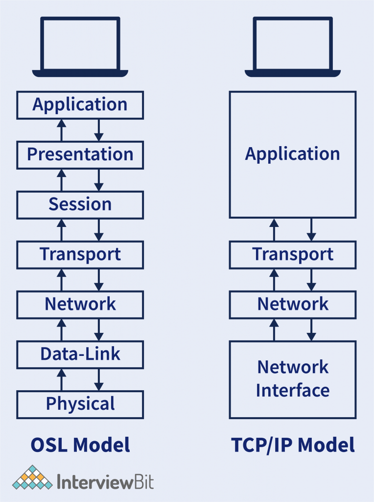

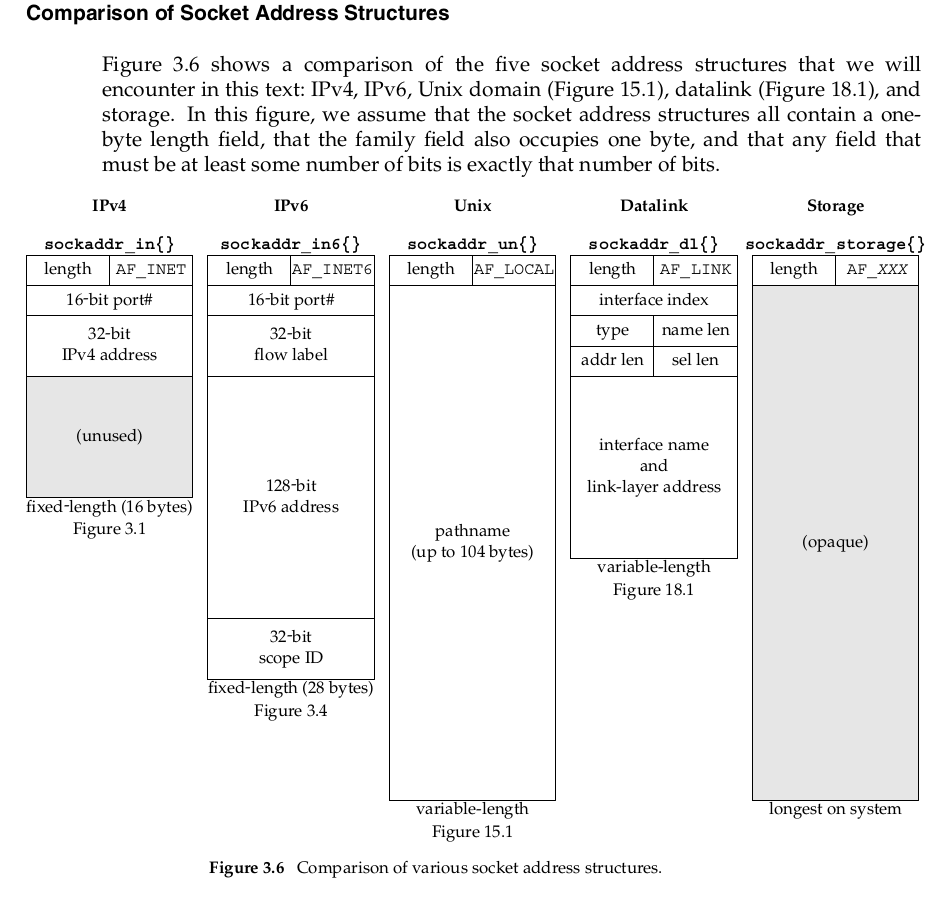

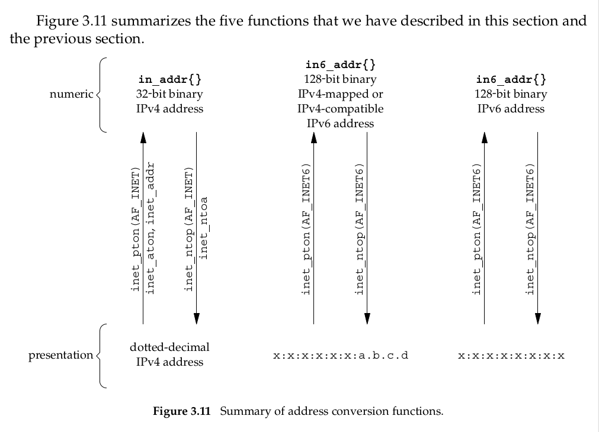

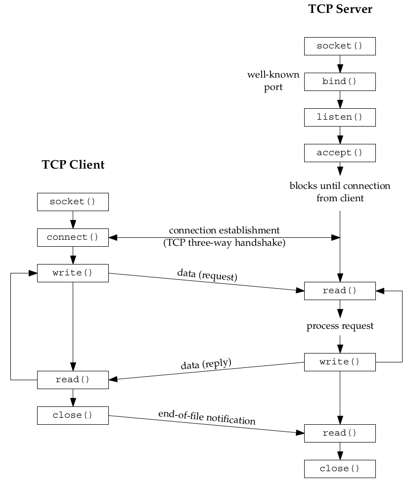

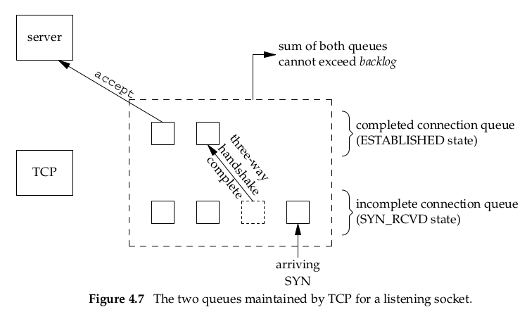

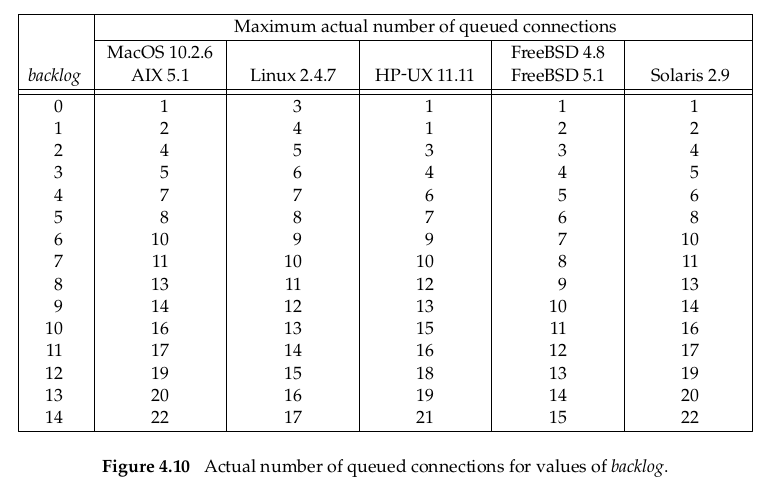

Mạch kiến thức hiện tại

```text
socket
  ↓
bind
  ↓
listen
  ↓
TCP handshake
  ↓
accept queue
  ↓
accept
  ↓
connfd
  ↓
read / write
  ↓
close
  ↓
FIN / ACK
  ↓
TCP state machine
  ↓
CLOSE_WAIT / FIN_WAIT / TIME_WAIT
  ↓
SO_REUSEADDR
```

**Liên hệ với toàn bộ TCP server**

```text
socket()
   │
   ▼
kernel socket object
   │
   ▼
bind()
   │
   ▼
local endpoint
192.168.1.10:8080
   │
   ▼
listen()
   │
   ▼
LISTEN
   │
   │ client connect()
   ▼
TCP handshake
   │
   ▼
accept()
   │
   ▼
connfd
   │
   ├───────────────┐
   │               │
   ▼               ▼
getsockname()   getpeername()
   │               │
   ▼               ▼
server endpoint  client endpoint
```

| Function             | Mean                                  |
| --------------- |------------------------------------------ |
| `socket()`      |system call → create kernel socket + FD       |
| `bind()`        | system call → bind local address to socket |
| `getsockname()` | system call → get local address from kernel  |
| `htons()`       | user-space byte conversion                 |
| `ntohs()`       | user-space byte conversion                 |
| `inet_pton()`   | user-space address conversion              |
| `inet_ntop()`   | user-space address conversion              |

## 1. What happens when the client calls connect()?

Suppose:

```text
Server: 192.168.1.10:8080
Client: 192.168.1.20:50000
```

Server has already:

```text
socket();
bind();
listen();
```

The server is currently `LISTEN`, then client gọi `connect(fd, ...);`

TCP handshake will occur:

```text
Client                         Server
  |                              |
  | -------- SYN --------------> |
  |                              |
  | <----- SYN + ACK ----------- |
  |                              |
  | -------- ACK --------------> |
  |                              |
  |       connection ready       |
```

After the final ACK, the TCP connection is established.

However, the `connfd` does not yet exist in the server application.

## Where is the connection located before accept()?

Kernel manages this connection.

```text
                    Linux Kernel
                         |
                 listening socket
                    port 8080
                         |
                         v
                +----------------+
                | pending queue  |
                +----------------+
                    |
                    +---- Client A
                    |
                    +---- Client B
                    |
                    +---- Client C
```

The application server still has `listen_fd = 3;` but does not have `connfd` cho Client A if it does not call `accept()`.

Server call:

`connfd = accept(listen_fd, ...);`

Kernel check:

`Is the connection ready?`

If have:

```text
pending queue
      |
      | take a connection
      v
+----------------+
| Client A       |
+----------------+
      |
      v
 create FD for process
      |
      v
connfd = 4
```

And then:

```text
Application

listen_fd = 3
connfd    = 4
```

## Client connect while server is blocking

We have:

```text
Server process

accept()
   |
   v
 BLOCKED

Client:

connect()
```

TCP handshake done:

```text
Client                    Kernel Server
  |                            |
  | SYN                        |
  |--------------------------->|
  |                            |
  | SYN/ACK                    |
  |<---------------------------|
  |                            |
  | ACK                        |
  |--------------------------->|
  |                            |
  |                    connection ready
  |                            |
  |                    queue = non-empty
  |                            |
  |                    wake server
  |                            |
  |                    accept() returns
```

## What is getsockname()?

**get socket's own name**

It is used to retrieve the **local address (local endpoint)** of a socket.

```text
              TCP connection

Client                         Server
192.168.1.20:52341   <---->   192.168.1.10:8080
      ↑                              ↑
   peer/local                     local/peer
```

If you are on the client side:

```text
getsockname(client_fd)
        ↓
192.168.1.20:52341
```

If you are on the server side:

```text
getsockname(connfd)
        ↓
192.168.1.10:8080
```

## What is getpeername()?

**get peer's name**

It retrieves the address of the **other end** of the socket.

| API             | Meaning                    |
| --------------- | -------------------------- |
| `getsockname()` | Which address am I using? |
| `getpeername()` | Who am I connecting with? |

**Why we need `getpeername()`?**

## TCP echo server (str_echo)

```text
                 TCP connection
Client                              Server

socket()                           socket()
   │                                  │
connect()                            bind()
   │                                  │
   │                                listen()
   │                                  │
   └──────────── TCP ────────────────►│
                                      │
                                   accept()
                                      │
                                      ▼
                                    connfd
                                      │
                               ┌──────┴──────┐
                               │             │
                             read()        write()
                               ▲             │
                               │             ▼
                               └──── client ┘
```

## Client walkthrough (str_cli)

```text
              CLIENT

       ┌───────────────┐
       │     stdin     │
       └───────┬───────┘
               │
             fgets
               │
               ▼
          write(socket)
               │
               │ TCP
               ▼
          SERVER
               │
            echo back
               │
               ▼
          read(socket)
               │
               ▼
       ┌───────────────┐
       │    stdout     │
       └───────────────┘
```

```text
TCP keepalive
application heartbeat
timeouts
```

## SIGPIPE Signal

When a process writes to a socket that has received an RST, the SIGPIPE signal is sent to the process. The default action of this signal is to terminate the process, so the process must catch the signal to avoid being involuntarily terminated.

```text
Client                         Server

connect()  ──────────────────►

           connection

close()    ──────────────────►
           FIN

                                write()
                                  ↓
                                EPIPE
                                  +
                                SIGPIPE
```

If the kernel already knows that the connection on the other end is no longer accepting data, writing may result in: `SIGPIPE`. If we ignore it, we can check the error with: `errno == EPIPE`.

# UDP

**What is UDP?**

> UDP - User Datagram Protocol - is a transport layer protocol that sits on top of IP.

UDP has a core characteristic:

> UDP sends each datagram independently, without establishing a connection and without guaranteeing delivery.

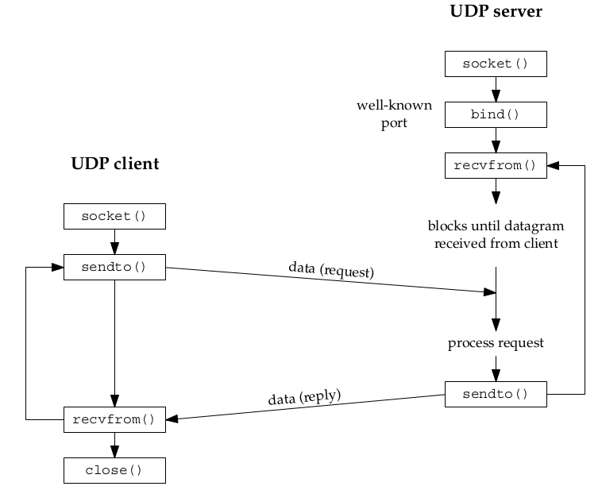

> NOTE:
>
> Since UDP is connectionless, there is no such thing as closing a UDP connection.

**Why UDP does not need accept?**

|TCP|--------------------------------|UDP|
|---|---|---|
|each connection has specific socket||only one socket for all connection|

```text
server socket                                   UDP socket
      |                                              |
      +--- client A socket               +-----------+-----------+
      |                                  |           |           |
      +--- client B socket             client A    client B    client C
      |
      +--- client C socket
```

The server receives a packet from `recvfrom()` and the kernel returns the following to the server:

```text
data
source IP
source port
```

Example:

```c
recvfrom()

"hello"
192.168.1.10:40001
```

then:

```c
recvfrom()

"world"
192.168.1.11:40002
```

Using the same UDP socket.

The image below provides a clearer description of the TCP and UDP models:

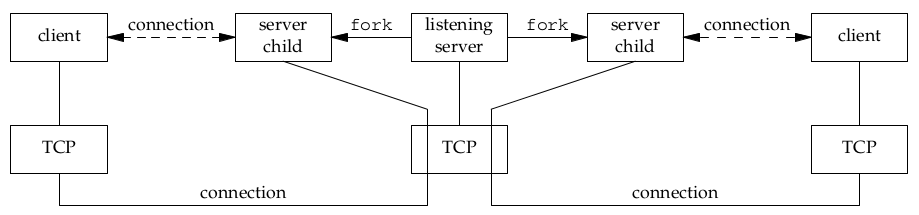

TCP

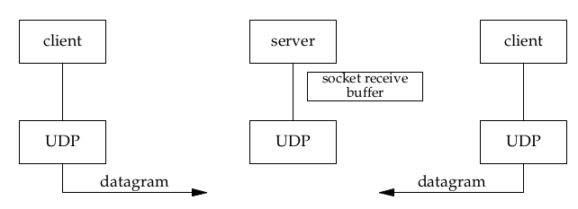

UDP

## `recvfrom` and `sendto` Functions

```c
#include <sys/socket.h>

ssize_t recvfrom(int sockfd, void *buff, size_t nbytes, int flags,
                 struct sockaddr *from, socklen_t *addrlen);

ssize_t sendto(int sockfd, const void *buff, size_t nbytes, int flags,
               const struct sockaddr *to, socklen_t addrlen);

/* Both return : number of bytes read or written if OK,
 * −1 on error
 */
```

- The first three arguments, `sockfd`, `buff`, and `nbytes`, are identical to the first three arguments for read and write.
- The `to` argument for `sendto` is a socket address structure containing the protocol address (IP address and port number) of where the data is to be sent.
- The `recvfrom` function fills in the socket address structure pointed to by `from` with the protocol address of who sent the datagram.

> NOTE:  
>
> - Writing a datagram of length 0 is acceptable. In the case of UDP, this results in an IP datagram containing an IP header (normally 20 bytes for IPv4 and 40 bytes for IPv6), an 8-byte UDP header, and no data.
>
> - This also means that a return value of 0 from `recvfrom` is acceptable for a datagram protocol: It does not mean that the peer has closed the connection, as does a return value of 0 from `read` on a TCP socket.

## UDP Echo Server and UDP Echo Client

The model of UDP Echo Server/Client:

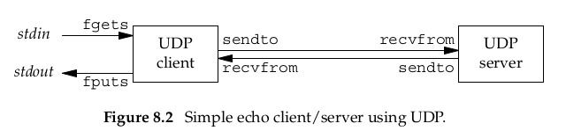

## connect() Function with UDP

> UDP can call `connect()`, but UDP `connect()` does not establish a connection like TCP.

When a socket is first initialized, it can send data to various addresses; for each transmission, the destination address and port must be specified.

Use `connect()` to bind the socket to the default address of the other end ( No three ways handshake).

After `connect()` we use `send` and `recv`, not use `sendto` and `recvfrom` because the socket already has address of receiver.

Some characteristics of using `connect()`:

- No need to pass the destination every time you send.
- The socket focuses on a single peer.
- You may receive certain related **ICMP** errors.

Example of a client sending UDP:

```text
Client
192.168.1.10:40000
| 
| UDP
v
192.168.1.100:9999
```

However, port 9999 does not exist on the server. A router or server might send an ICMP message:

```text
ICMP Destination Unreachable
Port Unreachable
```

With a connected UDP socket, the kernel can associate that error with the corresponding socket/peer and report the error to the application.

## Lack of Flow Control

**What is Flow Control?**

> Flow Control means TCPMake sure the sender does not overload the receiver by sending the data packets faster than speed the handle of the receiver.

### With TCP, where is Flow Control?

> Flow control is a technique used in TCP to regulate the rate of data transmission between a sender and a receiver based on the receiver’s ability to process incoming data.

**Receiver Window (rwnd)**  
<https://medium.com/@shubham.patel191295/understanding-flow-control-in-tcp-7665f0e58007>

> The Receiver Window is a field in the TCP header that tells the sender how much data the receiver can accept at a given time.
>
>> - It’s a dynamic value based on the receiver’s buffer availability.
>> - If the buffer is full, the receiver advertises a window size of 0, telling the sender to pause.

**Sliding Window Protocol**  
<https://medium.com/@shubham.patel191295/understanding-flow-control-in-tcp-7665f0e58007>

> TCP uses a sliding window mechanism to manage flow control efficiently.

How it works:

1. The sender can send multiple segments within the window size without waiting for individual ACKs.
2. As ACKs are received, the window “slides” forward, allowing more data to be sent.

Example: If the window size is 5000 bytes, and App1 sends 3 segments of 1000 bytes each, it can continue sending until it hits the 5000-byte limit. Once AppX acknowledges the first 1000 bytes, the window slides forward, and App1 can send another 1000 bytes.

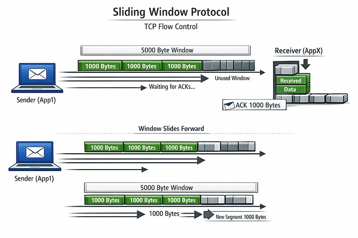

**Window Scaling**  
<https://medium.com/@shubham.patel191295/understanding-flow-control-in-tcp-7665f0e58007>

The Receiver Window field in the TCP header is only 16 bits, limiting the maximum window size to 65,535 bytes.

- On high-speed networks, this limit is too small.
- It can lead to underutilization of bandwidth.

Solution: Window Scaling (RFC 1323)

- Introduces a scaling factor (up to 14 bits).
- Allows window sizes up to 1 GB.

Example: If the scaling factor is 4, a window size of 16,384 bytes is interpreted as `16,384 × 2^4 = 262,144` bytes.

**Role of Acknowledgments in Flow Control**  
<https://medium.com/@shubham.patel191295/understanding-flow-control-in-tcp-7665f0e58007>

> - ACKs are not just for reliability — they also inform the sender about the receiver’s buffer status.
> - Each ACK includes the updated receiver window size.
> - The sender uses this to adjust its sending rate dynamically.

### UDP does not have this mechanism.

> UDP does not have built-in flow control, meaning a sender fires data packets as fast as it can without checking if the receiver is ready or capable of handling them.

**What Happens Without Flow Control?**

- **No Feedback**: The sender never waits for an acknowledgment message from the receiver before sending the next packet.
- **Receiver Overload**: If the sender transmits data faster than the receiver's CPU or buffer can process it, the receiver's buffer fills up and drops incoming packets.
- **Network Congestion**: Flooding the network with high-speed UDP packets can clog routers and switches, causing packet loss for other devices and traffic sharing the same path.
- **Application Responsibility**: If flow control or data recovery is needed, the application layer running on top of UDP must build and manage it manually.

**Why UDP Is Designed This Way?**

- **Maximum Speed**: Skipping acknowledgment handshakes and buffer tracking minimizes protocol overhead and reduces latency.
- **Real-Time Focus**: Protocols like live video streaming, online gaming, and VoIP prefer dropping late or lost data over pausing the stream to wait for retransmissions.

# Socket Operations

There are various ways to get and set the options that affect a socket:

- The getsockopt and setsockopt functions
- The fcntl function
- The ioctl function